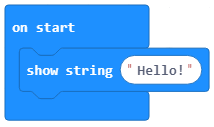
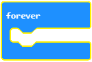

Blloqe nga Kategoria Basic
===============================

Kategoria |Basic| përfshin blloqet e përdorura për ekzekutimin (fillimin) e programeve, si dhe blloqet për shfaqjen e numrave, tekstit ose imazheve.

Është koha për të krijuar një program, i cili do të shfaq mesazhin "Përshëndetje!".

Për të shfaqur mesazhin përshëndetës (në ekranin Micro:bit), duhet të tërheqim bllokun |showstring| nga kategoria |Basic| në sipërfaqen e punës dhe futeni atë në bllokun |onstart|. Mund të shkruajmë mesazhin e dëshiruar "Përshëndetje!" duke klikuar në fushën e futjes së tekstit.

.. |Basic| image:: ../_images/_imageMicroBit/s2.png
.. |onstart| image:: ../_images/_imageMicroBit/s20.png

Vështrimi përfundimtar i programit, i cili shfaq mesazhin përshëndetës "Përshëndetje!":

Kemi dy mundësi për të testuar programin:

- për ta ekzekutuar atë në imituesin duke klikuar në butonin |play|.

- për ta shkarkuar atë në pajisjen Micro:bit. Për ta transferuar programin në pajisjen Micro:bit, duhet ta lidhim atë me kompjuterin duke përdorur kabllon USB. Ju shkarkoni file-n .hex në kompjuterin tuaj duke klikuar në butonin |download|.

Ne do të përdorim simulatorin për të testuar programin. Ekzekutimi i programit nxitet duke klikuar në butonin |play|, d.m.th. shfaqet fjalia përshëndetëse "Përshëndetje!"

**Detyrë** Krijoni një program i cili do të shfaq mesazhin "Përshëndetje!" në një numër të pafund.
**Ndihmë e vogël:** Blloku |forever| është blloku i cili do të përsërisë komandat e futura në të një numër të pafund. Drejtimi i këtij blloku nuk do të ndalet kurrë më vete. Për të ndaluar funksionimin e këtij blloku, duhet të shtypni butonin stop.

Ju mund ta krahasoni zgjidhjen tuaj me tonën: https://makecode.microbit.org/_9Cw5d6Czda1d

In the category |Basic| you can also find blocks for displaying defined images |showicons| or for displaying images which the user can create by turning on diodes on the LED screen (|showleds|).

.. |showleds| image:: ../_images/_imageMicroBit/s12.png

**Detyrë** Ju dëshironi të krijoni një program që shfaq një fytyrë të buzëqeshur në ekran.

Ju mund ta krahasoni zgjidhjen tuaj me tonën: https://makecode.microbit.org/_CAdaFfKsY46a

.. mchoice:: L1Z1
    :answer_a: Blloku onstart.
    :answer_b: Blloko forever.
    :feedback_a: Përgjigja nuk është e saktë. Blloku në onstart është një nga blloqet nga kategoria Basic, dhe blloqet brenda tij ekzekutohen vetëm një herë gjatë ekzekutimit të programit.
    :feedback_b: Bravo! Blloku forever është blloku brenda të cilit komandat do të ekzekutohen pafundësisht. Drejtimi i këtij blloku nuk do të ndalet kurrë më vete. Për të ndaluar funksionimin e këtij blloku, duhet të shtypni butonin stop (|stop|).
    :correct: b

    Cilin bllok, të përdorur për fillimin e një programi, do të duhet të përdorni nëse doni imazhet e një kutie bosh dhe një kutie të plotë për të alternuar në ekran?

Përveç blloqeve të përmendura më lart, në kategorinë |Basic|, mund të gjesh gjithashtu blloqet për shfaqjen e vlerave të numrave |shownumber|, blloqet e përdorura për të ngadalësuar drejtimin e programit |pause|, kodi i intervalit kohor paraqitet në milisekonda 1000ms është 1 sekondë, si dhe blloku për pastrimin e ekranit |clearall|

.. |shownumber| image:: ../_images/_imageMicroBit/15.png
.. |pause| image:: ../_images/_imageMicroBit/s39.png
.. |clearall| image:: ../_images/_imageMicroBit/s14.png
.. |stop| image:: ../_images/_imageMicroBit/p2.png

**Detyrë** Duke përdorur shembullin nga pyetja e mësipërme, për imazhet e alternuara të kutive, përpiquni të ngadalësoni kohën e nevojshme për ndryshimin e figurës, për dy sekonda.
**Ndihmë e vogël:** Përdorni bllokun |pause|.

Shih zgjidhjen: https://makecode.microbit.org/_F5h5UKD2Vgau

**Detyrë shtesë** Ju duhet të ndizni LED 3/5 në Micro:bit. Ekrani i LED-ve të ndriçuar duhet të jetë unik!

Ju mund ta krahasoni zgjidhjen tuaj me një nga zgjidhjet e mundshme: https://makecode.microbit.org/_29YWXrLHg22U
