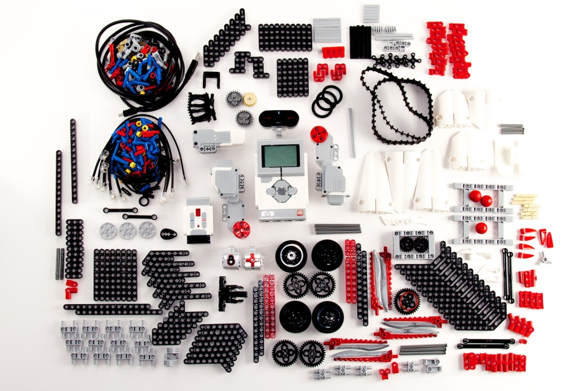
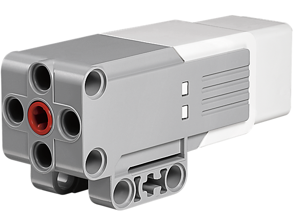
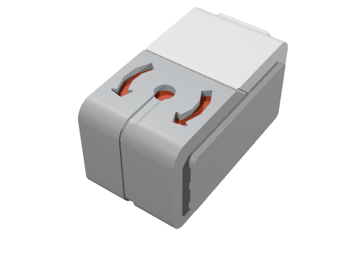
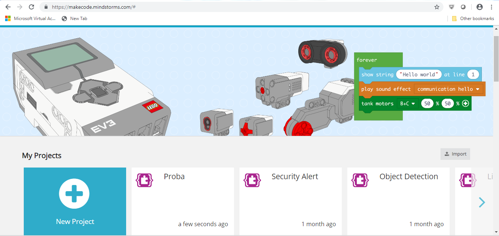

EV3 - Karakteristikat themelore dhe përbërësit
===========================================

Para se të fillojmë të flasim për programimin e robotëve Mindstorm Lego EV3 duke përdorur platformën online MakeCode, le të mësojmë së pari për karakteristikat themelore të robotëve EV3 dhe ndërfaqen MakeCode.

Bazat e robotëve LEGO EV3 - pajisje harduerike
:::::::::::::::::::::::::::::::::::::::::

Seti LEGO Mindstorms EV3 është i përbërë nga një larmi pjesësh mekanike dhe elektrike nga të cilat mund të mblidhen robotë me forma dhe qëllime të ndryshme.

Një robot ka nevojë për sensorë, të cilët mbledhin informacione nga mjedisi i tij (shqisat e robotit), një procesor që analizon këtë informacion, d.m.th. mendon (trurin e robotit), pjesë mekanike që lëvizin dhe kryejnë një aktivitet të caktuar, si dhe një burim energjie, i cili siguron energji për pjesë specifike të robotit dhe merr frymë në të në jetë.

Pjesët kryesore të robotit janë:

- Njësia e kontrollit

- Burimi i energjisë

- Portat

- Servo Motors

- Sensorë

**Njësia e Kontrollit (Brick EV3)**

Në shikim të parë, bëhet e qartë se pjesa qendrore e robotit është e zënë nga njësia katrore EV3 ku ndodhet procesori.
Është i lidhur me sensorët, nga i cili merr dhe përpunon informacion, përmes kabllove dhe porteve. Bazuar në parametrat që vendosëm në programet që krijojmë, ai mund të dërgojë sinjale kontrolli në pjesët mekanike, d.m.th., dhe gjithashtu mund të lëshojë paralajmërime të caktuara të dëgjueshme. Komunikimi midis kompjuterit dhe njësisë së kontrollit vendoset ose përmes Bluetooth ose kabllit USB.

Në fakt, funksionimi i robotit kontrollohet nga dy mikrokontrollorë të programueshëm AVR. Këto janë pajisje që përveç procesorit, përmbajnë disa periferikë, si memorie, timer, konvertues A / D, kështu që ato mund të programohen disa herë.

Sigurisht, ky integrim bëhet në kurriz të zvogëlimit të kujtesës mbi procesorin standard të kompjuterit, kështu që programet duhet të fshihen shpesh në mënyrë që përdoruesi të shkarkojë të reja.

Figura e mëposhtme tregon njësinë e kontrollit së bashku me ekranin përmes të cilit ne kontrollojmë operacionet e kryera në robot.

.. image:: ../_images/_imageEV3/brick1.png
      :align: center

.. image:: ../_images/_imageEV3/brick2.png
      :align: center

Për të aktivizuar Brick EV3, përdoruesi duhet të shtypë butonin në qendër. Kur shtypet butoni, drita e kubit do të jetë e kuqe dhe ekrani fillestar do të shfaqet.

Kur drita ndryshon në jeshile, Brick EV3 është e gatshme të shkojë. Për të fikur kubikun EV3, duhet të shtypni butonin e pasëm derisa të shfaqet ekrani i fikjes së energjisë. Duke klikuar në shenjën e konfirmimit dhe duke shtypur butonin në qendër, Brick EV3 do të fiket. Në rast se ju zgjidhni opsionin X, do të ktheheni në ekranin Run Recent.

**Burimi i energjisë**

Si çdo ndërtim elektromekanik, roboti LEGO Mindstorms EV3 kërkon fuqi. Furnizimi standard me energji robot LEGO është i përbërë nga 6 bateri AA 1.5V. Motorët elektrikë mundësohen nga 9V, dhe një nga mikrokontrolluesit dhe disa qarqe të integruar mundësohet nga 5V. Mikrokontrolluesi kryesor mundësohet nga 3.3V. Portet e daljes mundësohen nga 4.3V dhe kanë mbrojtje të tepërt.

Versione më të reja të robotit kanë bateri të rimbushshme si telefonat. Energjia mund të merret nga panelet diellore që roboti mund të ketë, si dhe nga rrjeti i qytetit nëse roboti nuk lëviz.

**Portat**

Ne kemi përmendur tashmë që njësia e kontrollit merr të dhëna nga mjedisi përmes sensorë, i përpunon ato dhe pastaj transmeton sinjalet përkatëse të kontrollit tek motorët. Komunikimi me pajisjet periferike bëhet përmes porteve.

Sipas drejtimit të të dhënave, portat mund të ndahen në porte hyrëse dhe dalëse. Ekzistojnë 4 porte secila.

.. image:: ../_images/_imageEV3/brick3.png
      :align: center

Njësia e daljes përbëhet nga motorë, dhe njësia hyrëse është e përbërë nga sensorë. Nëse përdoruesi nuk ndryshon diçka gjatë shkrimit të programit, si parazgjedhje portat e daljes ndahen dhe përdoren si më poshtë:

• porta A për motorët e mesëm

• porta B dhe C për dy motorë të mëdhenj të kombinuar

• porta D për një motor të madh

Gjithashtu, përveç nëse përdoruesi e përcakton ndryshe, si parazgjedhje portat e hyrjes caktohen si më poshtë:

• porta 1 për sensorin e prekjes

• porta 2 për sensorin e temperaturës ose sensorin gyro (gjiroskop)

• porta 3 për sensorin e ngjyrave (ndriçimi)

• porta 4 për zbulimin e dritës infra të kuqe ose sensorit tejzanor

**Motorët**

Çdo lloj lëvizjeje e bërë nga roboti do të ishte e paimagjinueshme pa motorët. Më shpesh, ekzistojnë tre servo motorë në dispozicion, këta motorë marrin sinjale elektrike përmes portave të tyre, të cilat u mundësojnë atyre të funksionojnë.
Motorët servo më së shpeshti përdoren kur forcat e vogla duhet të kapërcehen, siç janë hapja e dyerve të vogla, mbajtja e ngarkesave me dimensione të vogla në distanca të shkurtra dhe të ngjashme. Kjo është arsyeja pse ata kryesisht përdoren për të bërë robotë të vegjël, armë robotike dhe manipulues të tjerë. Motorët servo nuk kërkojnë një furnizim të fortë me energji elektrike, ata janë të lehtë për t'u kontrolluar, dhe janë të besueshëm.

.. image:: ../_images/_imageEV3/brick4.png
      :align: center
      :width: 350px

Baza e një servo motori është në të vërtetë një motor me një drejtim me një numër të caktuar ingranazhesh, dhe funksionimi i tyre bazohet në parimin e modulimit të gjerësisë së pulsit - PWM. Mikrokontrolluesi përpunon të dhënat në faktorin e mbushjes së sinjalit PWM (numri nga 0 në 100, dhe nga 0 në -100), dhe në bazë të këtij numri përcaktohet përqindja e kohëzgjatjes së sinjalit PWM.

Numrat pozitivë i referohen lëvizjes përpara dhe negative ndaj lëvizjes prapa. Përveç diferencës së dukshme në madhësi, motorët ndryshojnë në numrin e RPM (rotacionet në minutë). Motori më i madh është më i ngadalshëm por siguron më shumë fuqi.

Motori i mesëm është më i shpejtë dhe më i qëndrueshëm. Ai përmban tahografe, të cilët japin informacione për numrin e rrotullimeve dhe të dhëna të ndryshme të dobishme.

Me paraqitjen e duhur të ndërtimit dhe përdorueshmërinë e programit, ju mund të krijoni mekanizma të ndryshëm për lëvizje me të cilët roboti mund të lëvizë duke përdorur rrota dhe vemje; ajo mund të kërcejë si një bretkosë, të lëvizë si akrep, si dhe të kapë dhe të shtyjë objektet, dhe t'i vendosë ato në pika specifike.  

**Sensore** 

Si njerëzit, robotët kanë nevojë për shqisat për të analizuar mjedisin e tyre.

Roboti standard LEGO ka katër lloje sensorë:

• ultrasonic (ai që duket si sy), i cili përdoret për të përcaktuar distancën midis robotit dhe një pengese,

• optik (sensori i ngjyrave), i cili siç nënkupton emri, reagon ndaj nivelit të dritës në mjedisin e tij, d.m.th zbulon ngjyrën si një vlerë të spektrit elektromagnetik,

• sensori i zërit, i cili reagon ndaj nivelit të tingullit në mjedisin e tij; sensori i prekjes, i cili, e keni besuar, reagon ndaj prekjes, d.m.th. në butonin që shtypet,

• sensori gyro (xhiroskop), mat lëvizjen rrotulluese të objektit (robotit) dhe ndryshimet në orientimin e tij.

**Sensori Ultrasonic**

Ky është një sensor dixhital, i cili mat distancën nga një objekt.

Përveç marrësit me ultratinguj, i cili është një lloj mikrofoni special, ky sensor ka edhe një transmetues me ultratinguj. Transmetuesi dërgon një valë ultrasonice që lëshon pengesën dhe reflekton përsëri në robot. Kjo valë e kthimit merret nga marrësi, i cili është sensori aktual. Roboti llogarit largësinë në një pengesë duke matur kohën e kaluar nga momenti kur u lëshua vala ulrasonice derisa të kthehej jehona e kësaj valë, e cila ka reflektuar përsëri nga një objekt.

.. image:: ../_images/_imageEV3/brick6.jpg
      :align: center
      :width: 250px

Distanca mund të matet në inç ose centimetra. Kur përdoret shitje centimetri, distanca e matshme është midis 3 dhe 250cm, me saktësinë e +/- 1cm. Kur përdoren inç, distanca e matshme është midis 1 dhe 99 inç, me saktësinë e +/- 0.394 inç).
Shpejtësia e ultrasound është rreth 300 m / s, dhe vala e zërit udhëton nga transmetuesi në pengesë dhe mbrapa, duke kaluar distancën që është dyfishi i distancës nga roboti në pengesë. Procesori duhet vetëm të përdorë formulën s = v * t, për të llogaritur distancën nga pengesa.

.. image:: ../_images/_imageEV3/brick7.png
      :align: center

Për një matje më të saktë, duhet të merren parasysh aspekte të tjera, si fakti që shpejtësia e ultrazërit në ajër varet nga temperatura e ambientit dhe nga frekuenca e ultrazërit të emetuar nga transmetuesi i lidhur me sensorin.
Nuk është e vështirë të shihet se kjo karakteristikë na kujton një lakuriq nate që, megjithëse me një pamje të pamjaftueshme, është i orientuar në mënyrë të pakuptueshme në hapësirë falë gjetësve të saj të jehonës.

**Sensori optik**

Sensori i ngjyrave është një sensor dixhital që mund të zbulojë ngjyrën ose intensitetin e dritës që hyn në dritaren e vogël në fytyrën e sensorit. Lexohet 1 kHz / sek.

.. image:: ../_images/_imageEV3/brick8.png
      :align: center
      :width: 250px

Ky sensor reagon ndaj dritës ose ndryshimeve në dritën e ambientit. Më parë, sensorët ishin të zinj dhe të bardhë, dhe ata mund të njihnin disa hije gri. Në ditët e sotme, sensorët janë më kompleks dhe ata mund të njohin ngjyrën, d.m.th nivelin në spektrin elektromagnetik. Kjo është arsyeja pse ata shpesh quhen sensorë të ngjyrave.
Qeniet njerëzore (ndryshe nga kafshët) kanë një sens të zhvilluar të shikimit falë një truri shumë të zhvilluar, i cili është në gjendje të marrë dhe përpunojë një sasi të madhe informacioni, gjë që rezulton në njohjen e imazhit.

Sensori mund të përdoret për:

1. Ngjyrat e leximit: roboti njeh shtatë ngjyra (e zezë, blu, jeshile, e verdhë, e kuqe, e bardhë, kafe dhe plus asnjë ngjyrë). Për shembull, roboti mund të programohet për të renditur blloqet me ngjyra, të themi emrat e ngjyrave që njeh, ose të ndalojë veprimet kur njeh të kuqen.

2. Reflektimi i dritës: roboti përdor një llambë për të lëshuar dritën e kuqe dhe mat intensitetin e dritës që reflektohet nga objekti. Përdor një shkallë nga 0 (shumë e errët) në 100 (shumë e lehtë). Për shembull, roboti mund të programohet të lëvizë mbi sipërfaqen e bardhë derisa të dalë në një sipërfaqe të zezë.

3. Drita e ambientit (ambienti): roboti mat forcën e dritës së marrë nga mjedisi, për shembull, drita që vjen nga një llambë. Përdor të njëjtën shkallë si në opsionin e dytë. Për shembull, roboti mund të programohet për të ndezur një alarm zgjimi kur Dielli lind.

Ka kufizime të qarta kur bëhet fjalë për sensorë, d.m.th. robotë; Prandaj, orientimi në hapësirë ​​bazuar në imazhe në formën e një numri të madh pikash është i vështirë. Kjo është arsyeja pse ky sensor, dhe komunikimi përmes tij, është një sfidë e madhe për ndërtuesit.

**Sensori i Prekjes**

.. image:: ../_images/_imageEV3/brick9.png
      :align: center
      :width: 250px

Ky është në të vërtetë një ndërprerës, i cili ka dy kushte:

• shtypur (kur roboti prek një pengesë) ose

• lëshuar (kur sensori nuk po prek asnjë objekt).

**Xhiroskop** 

Xhiroskop është një sensor dixhital, i cili zbulon lëvizjen dhe ndryshimet në lëvizjen e robotit. Kur roboti lëviz, ky sensor do ta paraqesë këtë si ndryshimin në shpejtësinë e rrotullimit në gradë për sekondë (deg / s). Shkalla maksimale është 440 deg / s.

Bazuar në këto të dhëna, përdoruesi mund të përcaktojë nëse robot po kthehet, dhe gjithashtu të programojë këto kthesa (me saktësinë e +/- 3 gradë për një kthesë 90-shkallë).
Në mënyrë që sensori të prodhojë rezultate të sakta, është e nevojshme ta mbani robotin pa lëvizje para se ta ndizni, në mënyrë që sensori të mund të kalibrojë siç duhet.

Përveç atyre që u përmendën më lart, ekzistojnë edhe lloje të tjerë sensorë në dispozicion, siç janë sensori i zërit, sensori i temperaturës, sensori infra të kuqe, etj.

**Menyja kryesore e EV3**

EV3 Brick përmban katër ekrane themelorë, të cilët ju japin mundësinë e përdorimit të një game të gjerë funksionesh unike për EV3 Brick (nga diçka aq e thjeshtë sa fillimi dhe ndalimi i një programi, për të shkruar vetë programin).

**Drejtimi i fundit**

Një listë e programeve të shkarkuar dhe ekzekutues do të shfaqet në këtë ekran. Programi në krye të listës është programi që u përdor për herë të fundit.

**Navigimi i skedarëve**

Nga ky ekran, përdoruesi mund të hyjë dhe të menaxhojë të gjitha skedarët në EV3 Brick, përfshirë skedarët e ruajtur në kartat SD.

**Aplikimet** 

Brick EV3 vjen me katër aplikime. Përveç kësaj, përdoruesi mund të krijojë aplikacionet e tij / saj duke përdorur Softuerin EV3.

**Pamja e Portit**

Në ekranin e parë në Port View, përdoruesi mund të shohë se cilat porte kanë bashkangjitur sensorë dhe motorë, domethënë, cilat porte janë të okupuar. Duke përdorur butonat e navigimit EV3 Brick, përdoruesi mund të kontrollojë se cilat porte janë të okupuara dhe të shihni leximet aktuale nga sensorët dhe motorët.

**Kontrolli motorik**

Përdoruesi mund të kontrollojë lëvizjen e çdo motori të lidhur me njërën nga katër portat dalëse.

**Kontrolli IR (kontrolli infra të kuqe **

Kontrollon lëvizjen e çdo motori të lidhur me njërën nga katër portat dalëse duke përdorur "telekomandën" - Remote Infrared Beacon, dhe "marrësin" - Sensorin Infra të kuqe.

**Programi i tullave**

EV3 Brick vjen me një aplikacion në tulla të ngjashëm me një softuer që do të instalohej në një kompjuter. Në këtë mënyrë mund të krijohen programe të thjeshta, kjo është arsyeja pse është e përshtatshme për fillestarët. Një arsye tjetër është se përdoruesi mund të krijojë dhe testojë programe në vetë robot pa përdorur një kompjuter.

**Dialogu i tullave**

Leximi i vlerave të sensorëve dhe motorëve. Nëse sensorët dhe motorët janë të lidhur me tullën, një grafik do të tregojë leximet aktuale nga një prej sensorëve ose motorëve, të ngjashëm me një oshiloskop.

**Cilësimet**

Ky ekran mundëson hyrjen në cilësime të ndryshme të përgjithshme në Brick EV3, siç është vëllimi i tingullit, vendosja e lidhjeve Bluetooth ose Wi-Fi, dukshmëria ose specifikimet teknike për vetë Brick EV3. Cilësimet e ekranit dhe vëllimit, si dhe cilësimet e gjumit, d.m.th. koha joaktive që kalon para se njësia të kalojë në modalitetin e gjumit.

Ndërfaqja - Software
::::::::::::::::::::::::::

Për aplikime më të kërkuara, përdoren programe më të avancuara dhe mjedise zhvillimi, të cilat ofrojnë mundësi të mëdha për krijimin e programeve. Për shkak të popullaritetit dhe aplikimit të tyre në rritje, programuesit kanë zhvilluar (dhe janë ende duke zhvilluar) klasa të shumta në gjuhë programimi të njohura si C#, MatLab, dhe të tjera, posaçërisht për krijimin e aplikacioneve që kontrollojnë robotët LEGO. Varet nga përdoruesit të zgjedhin nëse ata do të grumbullojnë blloqe apo të shkruajnë një program si një seri udhëzimesh në njërën nga gjuhët e programimit.

Në këtë pjesë të kursit, ne do të trajtojmë mundësitë e platformës së zhvillimit të MakeCode. Në këtë ndërfaqe programuese, ju mund të krijoni programe të thjeshta si "Ecni djathtas për 5 sekonda dhe ndaloni", dhe gjithashtu mund të lini që imagjinata tuaj të lirë dhe të krijoni programe më komplekse duke përfshirë sensorë dhe motorë të ndryshëm.

Kur ne aksesojmë interfaqen Makecode (https://makecode.mindstorms.com/),

si me shumicën e programeve, vërejmë se pritet të krijojmë një projekt të ri (|Project|) ose të hapim një program tashmë ekzistues. Për të mësuar më shumë rreth ndërfaqes së programimit EV3 dhe për të mësuar se si të krijoni programin e parë, mund të përdorni opsionet Start ose të shikoni tutoriale të ndryshme.

Duke klikuar në butonin |Project| ose duke hapur një nga projektet ekzistuese, mund të hyni në ndërfaqen e programimit, e cila përmban blloqe që mund të përdorni për të kontrolluar robotët.

.. image:: ../_images/_imageEV3/4.png
      :align: center

Të gjitha blloqet e programimit të përdorura për të kontrolluar robotin janë të vendosura në paletën e bllokut në mes të ndërfaqes programuese. Blloqet e programit ndahen në kategori sipas llojit dhe qëllimit. Avantazhi i kësaj ndërfaqe është ekzistenca e një simulimi të robotëve.

Projektet
::::::::::

Në mësimet e mëposhtme, ne do të prezantojmë disa projekte interesante për programimin e robotëve EV3 duke përdorur platformën MakeCode. Të gjitha projektet bëhen hap pas hapi, kështu që të gjithë mund t'i bëjnë përsëri. Të gjitha procedurat për ndërtimin e projekteve janë shtjelluar, nga mënyra se si është krijuar programi deri në atë se si është testuar.

   .. toctree::
      :maxdepth: 2

      Project Task - Robot Movement.rst
      Project Task - Displaying Text and Graphics.rst
      Project Task - Using the Sensors.rst
      Project Task - Happy or Sad.rst
      Project Task - Forward and Backward.rst
      Project Task - Middle Button.rst
