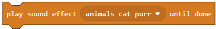
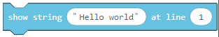
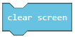
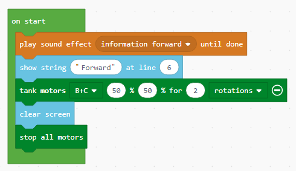

Detyra e projektit - Afishimi i tekstit dhe grafikës
============================================

Ky është një tjetër shembull i thjeshtë i krijimit të një programi, i cili lejon që roboti të thotë "Forward" dhe të shfaq të njëjtin mesazh në ekran, dhe pastaj të ecë përpara.

Bazuar në konfigurimin e detyrës, roboti duhet së pari të thotë mesazhin "Forward", të shfaq të njëjtin mesazh dhe pastaj të fillojë lëvizjen. Është e rëndësishme që së pari të tërhiqeni bllokun |Play| nga kategoria |Music|, dhe pastaj nga lista e saj drop-down zgjedhni tingullin e duhur. Ky bllok do të funksionojë derisa të flitet mesazhi i dëshiruar.
Pas kësaj, nga kategoria |Brick| ne do të tërheqim bllokun |Show|, i cili do të shfaq mesazhin në rreshtin 6.
Duhet ta vendosim mesazhin ``Forward`` në fushën e hyrjes, dhe më pas duhet të vendosim numrin e linjës në të cilën do të shfaqet mesazhi në ekranin e tullave.
Pas kësaj, duhet të tërheqim bllokun, i cili lejon që roboti të lëvizë për 2 rrotullime. Për të pastruar ekranin, ne do të përdorim bllokun |Clear|.

Pamja e programit:

Lidhni Brick EV3 me kompjuterin përmes kabllit USB dhe shkarkoni skedarin .uf2 në kompjuterin tuaj duke klikuar butonin |dugme1|. Duke tërhequr skedarin mbi EV3, është gati të fillojë punën.

.. |dugme1| image:: ../_images/_imageEV3/download.png
      :width: 199px
