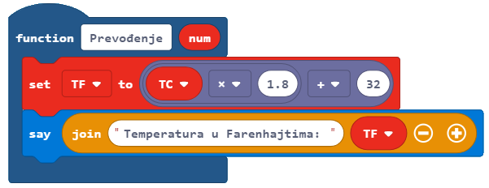
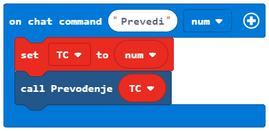

dDetyrë - Fahrenheit
==============================

Në programim, ripërdorimi i pjesëve të programit është shumë i rëndësishëm, sepse e bën programin më të thjeshtë dhe më të lexueshëm. Për të shmangur shkrimin e të njëjtit program dhe përsëritjen e programit të njëjtë ose të ngjashëm shumë herë, ne përdorim **funksione**.

Unazat do të përsërisin një pjesë të caktuar të kodit në një numër të caktuar. Funksionet do të drejtojnë kodin një herë, por përparësia e tyre është se kodi i tyre mund të përdoret në kohë të panumërta kudo dhe kurdo që na duhet në program. Një nga rolet kryesore të një funksioni është ndarja e programit në pjesë, të cilat kanë qëllime të përcaktuara mirë. Për shembull, për të bërë një pica, ju duhet të bëni brumin, të mbështillni brumin, shtoni topthat, shtoni përbërës të tjerë dhe përfundimisht ta piqni. Nëse keni dashur të programoni prodhimin e picave në Minecraft, mund ta ndani të gjithë procesin në pjesë duke përdorur funksione - një funksion për secilën pjesë të procesit të bërjes së picave, për shembull, duke e bërë brumin, pjekjen, etj.

Ne mund të organizojmë një seri blloqesh njëra pas tjetrës, duke krijuar kështu një funksion, të cilin më pas mund ta quajmë sa herë që na duhet për të kryer një aktivitet të caktuar brenda programit.

Ne do të përdorim një shembull të thjeshtë të konvertimit të temperaturës të shprehur në gradë Celsius në gradë Fahrenheit për të demonstruar përdorimin e funksioneve.

**Faza 1.**

**Duke menduar për detyrën:** Përdoruesi fut vlerën në gradë Celsius, dhe programi e konverton atë në gradë Fahrenheit. Do të përdorim formulën °F = °C × 1.8 + 32.

**Faza 2**

Hapni ``Code Builder`` (duke shtypur butonin ``C``); do të shfaqet një dritare redaktimi ku mund të vendosni blloqe.

Për shndërrimin e temperaturës nga gradë Celsius në gradë Fahrenheit, do të përdorim blloqet që do të vendosim në një funksion.

Ju mund të krijoni një funksion duke hapur nënkategorinë **Function** (1) nga kategoria |Advanced|, dhe duke klikuar në butonin **Make a Function** (2), pastaj në fushën hyrëse shkruani emrin e funksion që dëshironi të krijoni (3), në rastin tonë **Conversion**, duke klikuar në butonin **Number** (4) mund të shtojmë një parametër, i cili do të jetë një numër, ose më saktë vlera e temperaturës në gradë celcius përdoruesi dëshiron të konvertohet. Kur klikoni në butonin **Done** (5), funksioni do të krijohet (6):

.. image:: ../_images/_imageMinecraft/95.png
      :align: center

.. |Advanced| image:: ../_images/_imageMinecraft/s24.png
        :width: 100px

Duhet të krijojmë dy variabla ``TC`` dhe ``TF``, të cilat do të ruajnë vlerat e temperaturave në Celsius (ai i futur nga përdoruesi duke përdorur tastierën në bllokun |chat|) dhe në Fahrenheit (i llogaritur me formulë).

Në bllokun |Function| ne do të tërheqim blloqet e mëposhtme:

- blloku |set|, të cilin e përdorim për të përcaktuar vlerën e variablit ``TF``, duke përdorur formulën ``° F = ° C × 1.8 + 32``, të cilën do ta bëjmë duke përdorur blloqet nga kategoria |Math|,

- blloku |show|, i cili do të shfaq temperaturën në gradë Fahrenheit.

.. |Function| image:: ../_images/_imageMinecraft/s33.png

.. |set| image:: ../_images/_imageMinecraft/s34.png

.. |chat| image:: ../_images/_imageMinecraft/s27.png

.. |Math| image:: ../_images/_imageMinecraft/s16.png
            :width: 100px
.. |show| image:: ../_images/_imageMinecraft/s36.png

Tani kemi funksionin **Conversion**:

Për ta kthyer temperaturën nga Celsius në Fahrenheit, duhet ta quajmë funksionin e paraqitur më sipër në bllokun |chat

Në bllokun e përmendur më parë, duhet të tërheqim blloqet e mëposhtme:

- blloku që përcakton vlerën e variablës ``TC`` si vlera e futur nga përdoruesi në bisedë,

- blloku që thërret funksionin |call| nga kategoria |Function|.

Pamja e kodit:

Pamja e programit, i cili konverton temperaturën në gradë Celsius në Fahrenheit:

.. image:: ../_images/_imageMinecraft/98.png
      :align: center

**Hapi 3**

Testo programin.
Kliko butonin |Play|.

.. |Play| image:: ../_images/_imageMinecraft/15.png
          :width: 40px

Ne e hapim bisedën duke shtypur tastin T në tastierë dhe duke futur fjalën **Convert** dhe pas tij vlerën e dëshiruar. Ky do të jetë "shkaktari" ynë që fillon programin, i cili do të kryejë konvertimin.

.. image:: ../_images/_imageMinecraft/99.png
      :align: center
