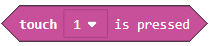

Detyrë - Happy or Sad
=============================

Deri më tani, të gjitha programet që kemi krijuar ishin programe lineare, më saktësisht, këto ishin programe ku komandat ekzekutohen rresht, njëra pas tjetrës deri në fund të programit.

Për dallim nga këto programe, ku çdo hap, d.m.th. çdo komandë, ekzekutohet një herë, në algoritme vendimmarrjeje, ose më saktë, me algoritme të kushtëzuara (degë) disa nga komandat do të ekzekutohen, dhe disa jo, gjë që do të varet nga fakti nëse kushti është përmbushur apo jo.

Ne do të demonstrojmë përdorimin e blloqeve vendimmarrëse duke krijuar një program, i cili do të shfaq imazhe të ndryshme në ekranin EV3, në varësi të faktit nëse sensori i prekjes është i shtypur apo jo. Nëse shtypet sensori, EV3 është i lumtur - një fytyrë e buzëqeshur do të shfaqet në ekran, dhe nëse jo, një fytyrë e trishtuar do të shfaqet në ekran.

Në disa programe, ekzekutimi i blloqeve nuk duhet të bëhet në të njëjtën mënyrë siç ishin vendosur në program. Blloqet e vendimmarrjes përdoren kur duhet të zgjedhim se cili pirg i blloqeve do të funksionojë. Cili rresht (degë) do të zgjidhet varet nëse kushti është përmbushur apo jo. Për robotin, nëse është përmbushur apo jo kushti, varet nga informacioni që merr nga sensori.

Për të krijuar një program i cili do të shfaqë një buzëqeshje apo një fytyrë të trishtuar, në varësi të faktit nëse sensori i prekjes është i shtypur apo jo, duhet të fillojmë një projekt të ri.

Në bllokun |forever| (të vendosura në kategorinë |Loops|) ne do të tërheqim bllokun |if..then| nga kategoria |Basic|. Në fushën e hyrjes së kushteve |uslov| ne do të tërheqim bllokun |touch|
Bazuar në konfigurimin e detyrës, kur shtypet sensori, programi duhet të shfaqë fytyrën e lumtur (buzëqesh). Ne duhet të tërheqim bllokun |show| nga kategoria |Basic| në degën YES.

.. |forever| image:: ../_images/_imageEV3/46.png
.. |Loops| image:: ../_images/_imageEV3/43.png
.. |if..then| image:: ../_images/_imageEV3/45.png
.. |Logic| image:: ../_images/_imageEV3/44.png
.. |uslov| image:: ../_images/_imageEV3/47.png

.. |show| image:: ../_images/_imageEV3/50.png
.. |Basic| image:: ../_images/_imageEV3/49.png

Pamja e programit kur shtypet sensori dhe simulimi.

.. image:: ../_images/_imageEV3/50_.png
      :align: center

Mund ta shohim që, edhe kur lëshojmë butonin e sensorit, imazhi i fytyrës së lumtur mbetet në ekranin e Brick EV3. Për të korrigjuar këtë gabim, do të duhet të përdorim bllokun |Clear|.

.. |Clear| image:: ../_images/_imageEV3/54.png

Pamja e programit kur shtypet sensori.

.. image:: ../_images/_imageEV3/55.png
      :align: center

Bazuar në konfigurimin e detyrës, ekziston edhe gjendja e cila lejon që një fytyrë e trishtuar të shfaqet në ekranin e Brick EV3 kur sensori i prekjes nuk shtypet. Për ta arritur këtë, duhet të shtojmë një degë tjetër "else" duke klikuar në shenjën |Plus| Brenda kësaj dege, ne do të shtojmë bllokun që do të shfaq fytyrën e trishtuar në ekran.

The final look of the code when the touch sensor is pressed or not pressed, and the simulation:

.. image:: ../_images/_imageEV3/57_.png
      :align: center

Në këtë shembull, rreshti i sipërm i kodit do të funksionojë nëse shtypet butoni, dhe rreshti i poshtëm do të funksionojë nëse butoni nuk shtypet.

Për ta ilustruar këtë, do të japim një shembull më shumë: Duhet të krijojmë një aplikim me të cilin roboti po ecën përpara derisa të shohë një pengesë (distanca duhet të jetë më e vogël se 30cm). Kur roboti sheh pengesën, duhet të kthehet djathtas, duke u përpjekur kështu të shkojë rreth tij.

Në bllokun |forever| (të vendosura në kategorinë |Loops|) ne do të tërheqim bllokun |if..then| nga kategoria |Logic|. Në fushën e hyrjes së kushteve |uslov| ne do të tërheqim bllokun |operacija|, i cili është një operator krahasimi. Për të krijuar gjendjen ku distanca midis robotit dhe pengesës është më e vogël se 30cm, ne do të mbledhim bllokun |manje30|. Bazuar në vendosjen e detyrës, kur pengesa është më pak se 30cm larg, roboti do të kthehet djathtas; përndryshe, ajo do të ecë përpara (nëse kushti nuk plotësohet, d.m.th., roboti nuk e sheh pengesën).

.. |operacija| image:: ../_images/_imageEV3/59.png

Ne do të shtojmë bllokun për kthimin |skreni| dhe për të ecur përpara |pravo|.

.. |skreni| image:: ../_images/_imageEV3/62.png
.. |pravo| image:: ../_images/_imageEV3/63.png

Pamja finale e kodit:

.. image:: ../_images/_imageEV3/60.png
      :align: center

Lidhni EV3 Brick me kompjuterin përmes kabllit USB dhe shkarkoni skedarin .uf2 në kompjuterin tuaj duke klikuar butonin |dugme1|. Duke tërhequr skedarin mbi EV3, është gati të fillojë punën.

.. |dugme1| image:: ../_images/_imageEV3/download.png
        :width: 199px
