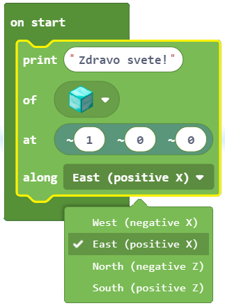
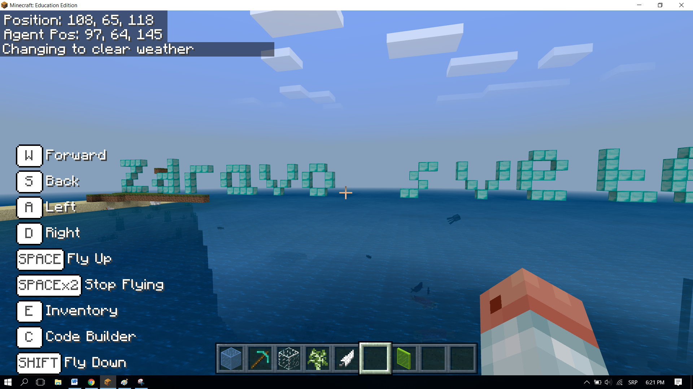

Detyra e projektit - Hello World
===============================================

Le të jetë ky një shembull i thjeshtë, ku mesazhi "Hello, World!" do të paraqitet në Minecraft.

Procedura për zgjidhjen e çdo detyre (problemi) përfshin përshkimin e secilës nga fazat vijuese:

  Faza 1: Mendoni për detyrën dhe shkruani ose vizatoni një algoritëm (hapa) për ta zgjidhur atë.

  Faza 2: Vendosni komandat në mënyrë që programi të funksionojë sipas algoritmit.

  Faza 3: Testoni programin dhe korrigjoni gabimet (nëse ka).

Ne do të kalojmë në të gjitha fazat së bashku, dhe do të krijojmë një program në të cilin ambienti i Minecraft (bota e krijuar) thotë përshëndetje.

**Faza 1**

**Duke menduar për detyrën:** Duhet të shfaqim përshëndetjen "Hello, World" në botën e krijuar.

**Faza 2**

Hapni ``Code Builder`` (duke shtypur butonin ``C``); do të shfaqet një dritare redaktori ku mund të vendosni blloqe.

Bazuar në algoritëm, duhet të shfaqim mesazhin e dëshiruar (teksti: "Hello, World!").

Për të shfaqur mesazhin duhet të përdorim bllokun |print| nga kategoria |Blocks|.

.. |print| image:: ../_images/_imageMinecraft/33.png

.. |Blocks| image:: ../_images/_imageMinecraft/33_.png

Ky bllok ka katër parametra, të cilët përcaktojnë se si dhe ku do të shfaqet (shkruhet) mesazhi në botën e Minecraft:

- Në fushën e futjes së tekstit të bllokut ``print``, do të shtypim tekstin e dëshiruar. Në rastin tonë, ky do të jetë porosia ``Hello, World!``.

- Në fushën ``of``, ne mund të zgjedhim llojin e bllokut që do të përdoret për krijimin e tekstit.

- Në fushën ``at``, ne do të përcaktojmë pozicionin, ose më saktë koordinatat ku duam që teksti të shfaqet në botën tonë. Minecraft është një botë tre-dimensionale e përcaktuar nga tre koordinata (X, Y, Z):

     • X - koordinoni lindje / perëndim

     • Y - koordinoni lart / poshtë (sa lart ose poshtë bllokohet pozicionimi në lidhje me bazën)

     • Z - koordinoni në jug / veri

- Në fushën ``along``, mund të përcaktojmë orientimin, ose më saktë, boshtin përgjatë të cilit shfaqet (printohet) teksti.

Në bllokun ``onstart`` ne do të tërheqim bllokun ``print`` ku do të vendosim sa vijon:

	Në fushën e vendosjes së tekstit ``Hello, World!``

	Në fushën ``of``, do zgjedhim ``Block of Diamond`` nga lista, ky do të jetë "materiali" që do të përdorim për të shkruar mesazhin.

.. image:: ../_images/_imageMinecraft/35.png
      :align: center
      :width: 350px

	Në fushën ``at``, në fushën e vendosjes së koordinatave x, do të vendosim vlerën 1.

	Do të përcaktojmë fushën ``along`` duke zgjedhur opsionin``East (positive X)`` nga lista drop-down.

Pas të gjitha ndryshimeve, programi i cili do të shfaqë përshëndetjen do të duket si ky:

.. image:: ../_images/_imageMinecraft/37.png
      :align: center

**Faza 3**

Testimi i programit.
Klikoni në butonin |Play|

.. |Play| image:: ../_images/_imageMinecraft/15.png
          :width: 40px

"Hello, World!" shfaqet në botën Minecraft:

Pasi të kemi testuar programin, mund të konkludojmë se ai bëri atë që donim. Përshëndetja jonë shfaqet kur hapim botën tonë të Minecraft.
