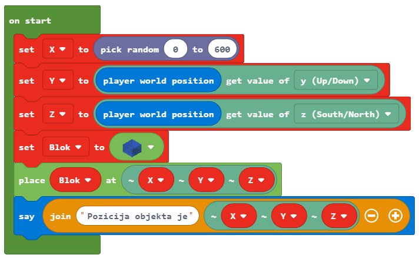

Detyrë - Hot and Cold
==================================

Njësoj si ju, programet në MakeCode mund të marrin vendime. Deri më tani, të gjitha programet që kemi krijuar ishin programe lineare, ose më saktë, programe ku komandat ekzekutohen rresht, njëra pas tjetrës deri në fund të programit. Për dallim nga këto programe, ku çdo hap, d.m.th. çdo komandë, ekzekutohet një herë, në algoritme vendimmarrjeje, ose më saktë, algoritme të kushtëzuara (degë) disa nga komandat do të ekzekutohen, dhe disa jo, të cilat do të varen nëse kushti është përmbushur apo jo.

Ne do ta demonstrojmë këtë koncept duke programuar lojën Hot and Cold. Bazuar në pozicionin e personazhit (lojtari), shfaqet një mesazh se sa larg ndodhet nga një objekt i vendosur diku në botë. Nëse personazhi është afër do të thuhet fjala Nxehtë dhe nëse personazhi është larg objektit do të thuhet fjala Cold. Nëse personazhi (lojtari) është shumë afër objektit programi do të thotë Scorching, dhe nëse është shumë larg, programi do të thotë ngrirje.

**Faza 1.**

**Të menduarit për detyrën:** Për të përcaktuar distancën e një objekti nga personazhi (lojtari) duhet të matim distancën midis tyre, dhe bazuar në ato vlera do të marrim mesazhin e dëshiruar.

**Faza 2**

Hapni ``Code Builder`` (duke shtypur butonin ``C``); do të shfaqet një dritare redaktori ku mund të vendosni blloqe.

Në fillim, duhet të përcaktojmë objektin dhe ta vendosim atë në botë, gjë që do të bëjmë në bllokun e fillimit. Ne do ta përcaktojmë pozicionin në atë mënyrë që koordinata X të ketë një vlerë të rastësishme nga intervali 0 deri në 600, dhe dy koordinatat e mbetura kanë vlerën Y dhe Z të lojtarit.

Për ta arritur këtë duhet të krijojmë variablat ``X, Y, Z`` (ata ruajnë koordinatat e pozicionit të objektit) dhe ``Block`` ruan objektin). Gjithashtu duhet të vendosim vlera fillestare për variablat që krijuam.

Në bllokun |start| ne do të përcaktojmë pozicionin dhe llojin e objektit duke tërhequr blloqet në mënyrën e mëposhtme:

- ne përcaktojmë koordinatën x me variablin ``X``, e cila do të ketë vlerën e rastit nga intervali 0 deri në 600, kjo arrihet me bllokun |random| nga kategoria |Math|.

- ne përcaktojmë koordinatën y me variablin ``Y``, e cila do të ketë vlerën e koordinatës y të pozicionit të lojtarit në botë. Kjo arrihet me bllokun |getY| nga kategoria |Positions|, ku do të vendosim variablin `` Y`` në vend të variablit **position**, dhe bllokut |world| nga kategoria |Player|

- ne përcaktojmë koordinatën z me variablin ``Z``, e cila do të ketë vlerën e koordinatës z të pozicionit të lojtarit në botë. Kjo arrihet me bllokun |getZ| nga kategoria |Positions|, ku do të vendosim variablin ``Z`` në vend të variablit **position**, dhe bllokut |world| nga kategoria |Player|

- ne përcaktojmë objektin që do të vendoset diku në botë. Kjo arrihet duke përdorur bllok |blok| nga kategoria |Blocks|.

.. |start| image:: ../_images/_imageMinecraft/28.png
              :width: 150px

.. |random| image:: ../_images/_imageMinecraft/s15.png

.. |world| image:: ../_images/_imageMinecraft/42_.png

.. |Math| image:: ../_images/_imageMinecraft/s16.png
              :width: 100px

.. |getZ| image:: ../_images/_imageMinecraft/s18.png

.. |Player| image:: ../_images/_imageMinecraft/27_.png
              :width: 100px

.. |Positions| image:: ../_images/_imageMinecraft/0.png
              :width: 100px

.. |Blocks| image:: ../_images/_imageMinecraft/33_.png
              :width: 100px

.. |blok| image:: ../_images/_imageMinecraft/79.png
              :width: 80px

Pamja e kodit pas përcaktimit të variablave:

.. image:: ../_images/_imageMinecraft/80.png
      :align: center

Pasi të jenë përcaktuar variablat dhe objekti, duhet të tërheqim bllokun, i cili fizikisht do ta vendosë atë objekt diku në botë.
Për këtë ne do të përdorim bllokun |place| nga kategoria |Blocks|. Ky bllok ka dy blloqe argumentesh, në bllokun e parë të argumenteve do të tërheqim variablin |b1|, dhe në të dytën do të vendosim koordinatat |X|, |Y| dhe |Z| për përcaktimin e pozitës së objektit duke përdorur bllokun |b2| nga kategoria |Positions|.

.. |b1| image:: ../_images/_imageMinecraft/s20.png

.. |X| image:: ../_images/_imageMinecraft/s21.png

.. |Y| image:: ../_images/_imageMinecraft/s22.png

.. |Z| image:: ../_images/_imageMinecraft/s23.png

.. |b2| image:: ../_images/_imageMinecraft/82.png

Pamja e kodit të modifikuar:

.. image:: ../_images/_imageMinecraft/81.png
      :align: center

Në këtë mënyrë, ne përfunduam pozicionimin e objektit në botën e Minecraft. Nëse duam të shohim koordinatat e saj mund të përdorim bllokun |say|. Për shfaqjen e këtij informacioni mund të përdorim bllokun |join| nga nënkategoria |Text| të kategorisë |Advanced|.

.. |say| image:: ../_images/_imageMinecraft/27.png

.. |join| image:: ../_images/_imageMinecraft/s26.png

.. |Text| image:: ../_images/_imageMinecraft/s25.png
            :width: 100px

.. |Advanced| image:: ../_images/_imageMinecraft/s24.png
            :width: 100px

Pamja e programit pas shtimit të këtij blloku:

Hapi ynë tjetër do të ishte tërheqja e blloqeve, të cilat do të përdorim për të përcaktuar distancën midis objektit të vendosur në botë dhe personazhit (lojtar), në bllokun |chat| Ne do ta bëjmë këtë duke përcaktuar variabel të cilat do të ruajnë pozicionin e personazhit (luajtës), d.m.th. ato ruajnë koordinatat x, y dhe z të karakterit. Koordinatat individuale merren duke përdorur bllokun |world| dhe bllok |getof|.

.. |chat| image:: ../_images/_imageMinecraft/s27.png
.. |getof| image:: ../_images/_imageMinecraft/s28.png

Ne krijojmë variablat **X1, Y1** dhe **Z1** dhe u japim atyre vlerat e koordinatave të pozicionit të personazhit:

.. image:: ../_images/_imageMinecraft/84.png
      :align: center

Për të llogaritur distancën midis karakterit dhe objektit, duhet të aplikojmë formulën e përdorur edhe në matematikë për përcaktimin e distancës në 3D midis dy pikave A (x1, y1, z1) dhe B(x2, y2, z2):

.. image:: ../_images/_imageMinecraft/s29.png
      :align: center

Ne krijojmë variablin **distance**, dhe japim vlerën e cila fitohet duke përdorur formulën për llogaritjen e distancës midis dy pikave.

Në MakeCode, operacionet matematikore janë të vendosura në kategorinë | Matematikë | Ne do të ndërtojmë formulën e përmendur më lart duke thjesht shtuar blloqe të përshtatshme (``+``, ``-``, dhe katrori ``**``, si dhe rrënja katrore):

.. image:: ../_images/_imageMinecraft/85.png
      :align: center

Pamja e kodit të përditësuar:

.. image:: ../_images/_imageMinecraft/86.png
      :align: center

Tani që kemi vlerën e variablit **distance**, mund ta përfundojmë lojën tonë Nxehtë dhe të Ftohtë.

Bazuar në atë se sa larg karakterit (lojtari) është nga objekti, Minecraft informon personazhin (luajtësin) për vendndodhjen e objektit me mesazhe të shkurtra si **Hot**, nëse objekti është afër, dhe **Cold**, nëse objekti është larg. Nëse personazhi (luajtësi) është shumë afër objektit, programi do të thotë **Scorching**, dhe nëse është shumë larg, programi do të thotë **Freezing**.

Bazuar në përcaktimin e detyrës:

- Nëse distanca midis karakterit (luajtësit) dhe objektit është më shumë se 100 blloqe, programi duhet të thotë Freezing.
- Nëse distanca midis karakterit (luajtësit) dhe objektit është më shumë se 50 blloqe, programi duhet të thotë Cold.
- Nëse distanca midis karakterit (luajtësit) dhe objektit është më shumë se 25 blloqe, programi duhet të thotë Hot.
- Nëse distanca midis karakterit (luajtësit) dhe objektit është më shumë se 12 blloqe, programi duhet të thotë Scorching.
- Nëse objekti ndodhet pranë luajtësit (distanca është 0), programi duhet të thotë Found.

Për këtë, ne do të përdorim bllokun |ifthen| dhe operatorët e krahasimit (> dhe =) nga kategoria |Logic| Ne shtojmë degët duke klikuar në shenjën +.
Pamja e kodit pas shtimit të këtyre blloqeve:

.. |ifthen| image:: ../_images/_imageMinecraft/s32.png
.. |Logic| image:: ../_images/_imageMinecraft/s31.png

Pamja finale e programit për lojën Hot and Cold:

.. image:: ../_images/_imageMinecraft/89.png
      :align: center

**Faza 3**

Testo programin.
Kliko butonin |Play|.

.. |Play| image:: ../_images/_imageMinecraft/15.png
          :width: 40px

Ne e fillojmë bisedën duke shtypur tastin T në tastierë, dhe fusim fjalën në chat, i cili do të jetë "shkas" për fillimin e lojës.

.. image:: ../_images/_imageMinecraft/90.png
      :align: center

.. image:: ../_images/_imageMinecraft/91.png
      :align: center
