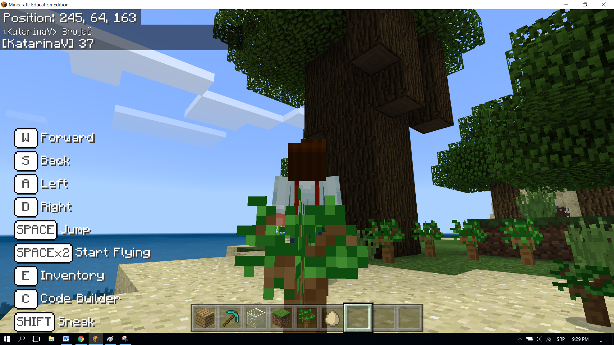

Detyrë - Sa pemë janë?
=========================================

Një kompjuter ka nevojë për kontejnerë për ruajtjen e numrave, teksteve dhe informacioneve të tjera, kështu që ai mund të marrë disa vendime bazuar në atë informacion. Për shembull, nëse duam të bëjmë një parashikim të motit, na duhen ndryshore siç janë temperatura, koha e ditës, ditët e javës, reshjet, etj.

Një variabël mund të kuptohet si një hapësirë ​​në kujtesën e kompjuterit, diçka si kuti, në të cilën, gjatë ekzekutimit të programit, ne mund të ruajmë disa vlera të përkohshme. (psh. numri i pemëve të mbjella në botë).

Çdo variabël ruan një lloj informacioni specifik. Herën e parë që e përdorim, duhet të përcaktojmë llojin e tij (numrin, vargun (teksti - një varg personazhesh alfanumerike)), logjike (të vërteta, false). Nga ai moment deri në fund të programit, ne mund të ruajmë vetëm atë lloj specifik informacioni në atë ndryshore.

Variablat kanë emra. Kur duam të përdorim vlerën e variblit, mjafton të përdorim emrin e saj.

**E rëndësishme**: Zgjedhja e emrit të duhur për variablib e bën më të lehtë kuptimin e programeve që kemi krijuar. Për shembull, nëse duam të ruajmë numrin e jetës së lojtarit në një lojë, mund të emërtojmë numrin e ndryshueshëm_live, i cili do të ishte më i mirë se i gjallë ose i numrit. Emrat e variablave përmbajnë shkronja, numra dhe karakter të veçantë _, dhe ato gjithmonë duhet të fillojnë me një letër.

Në shembullin e mëparshëm, ne pamë se pozicioni i një objekti (personazhi, bota) është një lloj i veçantë i variablit, e cila përmban tre numra që përshkruajnë një vendndodhje të veçantë në hapësirën tre-dimensionale. Këta numra quhen koordinata X, Y dhe Z.

Ne do të përdorim një shembull të një programi, i cili numëron numrin e pemëve të mbjella nga personazhi ndërsa lëviz në botë, për të demonstruar se si mund të krijojmë dhe përdorim variabla.

**Hapi 1.**

**Të menduarit për detyrën:** Pemët mbillen duke lëvizur nëpër botë. Sa herë që mbillet një pemë, rritet numri i pemëve në botë.

**Hapi 2.**

Hapni ``Code Builder`` (duke shtypur butonin ``C``); do të shfaqet një dritare redaktori ku mund të vendosni blloqe.

Për të numëruar pemët e mbjella, ne do të përmirësojmë programin nga projekti mbjellja e pemëve:

.. image:: ../_images/_imageMinecraft/55.png
          :align: center

Duhet të krijojmë ndryshoren **Counter**, e cila do të ruajë numrin e pemëve të mbjella.

Një variabël është krijuar në mënyrën e mëposhtme, në kategorinë `` Variabël`` (1), klikoni në butonin ``Make a variable`` (2) dhe shkruani emrin e atij variabli në fushën (3), në rastin tonë **Counter**. Duke klikuar butonin OK (4), ju keni krijuar një ndryshore (5):

.. image:: ../_images/_imageMinecraft/53.png
          :align: center

Vlera fillestare e variablit **Counter** është 0.

Vendosja e vlerës fillestare (rivendosja në vlerën fillestare) përcaktohet me bllokun |onstart| Kjo do të thotë se sa herë që fillon programi, Minecraft vendos vlerën e banakut në 0, dhe numërimi i pemëve mund të fillojë.

.. |start| image:: ../_images/_imageMinecraft/28.png
          :width: 150px

.. |Loops| image:: ../_images/_imageMinecraft/2_.png
          :width: 100px

.. |Variables| image:: ../_images/_imageMinecraft/3_.png
          :width: 100px

Nga kategoria |Loops| zgjidhni bllokun |onstart|. Ne do ta përdorim këtë bllok si "shkas" për rivendosjen e variablit **Counter**.

Nga kategoria |Variable| tërhiqni bllokun |set| Kundër ``0``:

.. image:: ../_images/_imageMinecraft/54.png
          :align: center

And now, we will upgrade the program for Planting trees:

.. image:: ../_images/_imageMinecraft/55.png
          :align: center

duke shtuar pjesën që do të regjistrohet kur ndryshon vlera e variablit **Counter**.

Tani duhet të përdorim variablin **Counter**, vlera e së cilës vendoset në 0. Vlera e kësaj ndryshore do të ndryshojë (rritet me një) sa herë që personazhi vendos një bllok, d.m.th. mbjell një pemë.

Për këtë, ne do të përdorim bllokun |change| nga kategoria ``Variable``. Ne do ta tërheqim këtë bllok në pjesën e kodit që përdoret për vendosjen (mbjelljen) e pemëve, si dhe bllokun që do të përdorim për të shfaqur (të themi) sa pemë janë mbjellë.

Pamja e kodit pas ndryshimit:

.. image:: ../_images/_imageMinecraft/56.png
          :align: center

Më në fund, për të parë se sa pemë u mbollën, ne do të prezantojmë bllokun |chat| në të cilën ne do të tërheqim bllokun |say|. Në këtë bllok, ne do të futim bllokun |Broj|.

.. |chat| image:: ../_images/_imageMinecraft/8_.png
.. |say| image:: ../_images/_imageMinecraft/27.png
            :width: 100px
.. |Broj| image:: ../_images/_imageMinecraft/9_.png

Pamja e kodit:

Pamja e programit për numërimin e pemëve:

.. image:: ../_images/_imageMinecraft/59.png
          :align: center

**Hapi 3.**

Testimi i programi:
Kliko butonin |Play|.

.. |Play| image:: ../_images/_imageMinecraft/15.png
          :width: 40px

Pasi të kemi testuar programin, mund të konkludojmë se ai bëri atë që donim. Numëron sa pemë personazhi ka mbjellur duke lëvizur në botë.
