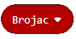
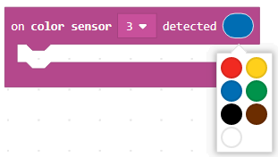

Detyrë - Butoni i mesit
=================================

Një variabël ruan vlera që mund t’i përdorim më vonë në program.

Një variabël mund të jetë:

• numerike (ruan një numër)

• Logjike (ruan vlera logjike të vërteta / false)

• Teksti (teksti i dyqanit "Hello")

Një variabël mund të kuptohet si një hapësirë në kujtesën e kompjuterit, diçka si kuti, në të cilën, gjatë ekzekutimit të programit, ne mund të ruajmë disa vlera të përkohshme. Variablat kanë emra. Kur duam të përdorim vlerën e variablit, mjafton të përdorim emrin e saj.

Një variabël është krijuar në mënyrën e mëposhtme, në kategorinë Variablat (1), klikoni në butonin Bëni një ndryshore (2) dhe shkruani emrin e atij variabli në fushën (3). Duke klikuar butonin OK (4), ju keni krijuar një variabël.

.. image:: ../_images/_imageEV3/42.png
      :align: center

Ne do të demonstrojmë përdorimin e variablave duke krijuar një program, i cili tregon sa herë përdoruesi shtypi butonin e mesëm në EV3 Brick.

Duhet të krijojmë variablin |Brojac|. Ne do ta vendosim vlerën fillestare të numërues të jetë 0, duke përdorur bllokun |setBrojac|. Ne pastaj e tërheqim këtë bllok në bllokun |onstart|. Brenda këtij blloku, ne do të tregojmë edhe vlerën e numëruesit që në fillim në ekranin e EV3 Brick duke përdorur bllokun |show|.

.. |setBrojac| image:: ../_images/_imageEV3/70.png
.. |Start| image:: ../_images/_imageEV3/8.png
.. |show| image:: ../_images/_imageEV3/77.png

Pamja e kodit:

.. image:: ../_images/_imageEV3/74.png
      :align: center

Bazuar në konfigurimin e detyrës, duhet të regjistrohemi sa herë që përdoruesi shtyp butonin e mesëm në tullë. Kjo do të arrihet duke përdorur bllokun e mëposhtëm:

.. image:: ../_images/_imageEV3/78.png
      :align: center

Kur regjistrohet presioni i bërë në butonin e mesëm të tullave, vlera e numëruesit duhet të rritet me 1. Ne mund ta bëjmë këtë duke përdorur bllokun |change| nga kategoria |Variable|. Ne do të përdorim bllokun |show| për të shfaqur vlerën e re të variablit Counter.

.. |change| image:: ../_images/_imageEV3/79.png
.. |Variable| image:: ../_images/_imageEV3/80.png

Pamja e kodit:

.. image:: ../_images/_imageEV3/75.png
      :align: center

Pamja e kodit final:

.. image:: ../_images/_imageEV3/76.png
      :align: center

Lidhni EV3 Brick me kompjuterin përmes kabllit USB dhe shkarkoni skedarin .uf2 në kompjuterin tuaj duke klikuar butonin |dugme1|. Duke tërhequr skedarin mbi EV3, është gati të fillojë punën.

.. |dugme1| image:: ../_images/_imageEV3/download.png
              :width: 199px

Simulimi:

Mund të demonstrojmë përdorimin e variablave me një shembull tjetër. Ne mund të krijojmë një program, i cili do të numërojë sa linja të zeza ka kaluar roboti LEGO.

Le ta krijojmë ndryshoren |Brojac|. Duke përdorur bllokun |setBrojac|, do ta vendosim vlerën fillestare të jetë 0.
Ne pastaj duhet ta tërheqim këtë bllok në bllokun |onstart|. Brenda këtij blloku, ne do të tregojmë edhe vlerën e numëruesit që në fillim në ekranin e EV3 Brick duke përdorur bllokun |show|. Ne gjithashtu do të tërheqim bllokun |pravo| në bllokun e dhënë, i cili do të mundësojë që roboti të lëvizë vazhdimisht.

.. |pravo| image:: ../_images/_imageEV3/6.png

Pamja e kodit:

Bazuar në konfigurimin e detyrës, ne kemi nevojë për sensorin për të regjistruar të zezën; kjo do të arrihet duke përdorur bllokun që ka listën rënëse nga e cila mund të zgjedhim ngjyrën e zezë:

Kur sensori regjistron të zezën, është e nevojshme të rritet vlera e numëruesit me 1. Ne mund ta bëjmë këtë duke përdorur bllokun |change| nga kategoria |Variable|. Për shfaqjen e vlerës së re të variablit Counter, ne do të përdorim bllokun |shpow|

Pamja e kodite:

.. image:: ../_images/_imageEV3/82_.png
      :align: center

Pamja e kodit final:

.. image:: ../_images/_imageEV3/81.png
      :align: center

Lidhni EV3 Brickme kompjuterin përmes kabllit USB dhe shkarkoni skedarin .uf2 në kompjuterin tuaj duke klikuar butonin |dugme1|. Duke tërhequr skedarin mbi EV3, është gati të fillojë punën.
