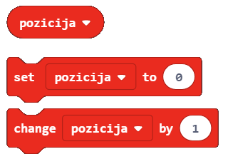
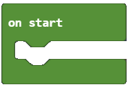
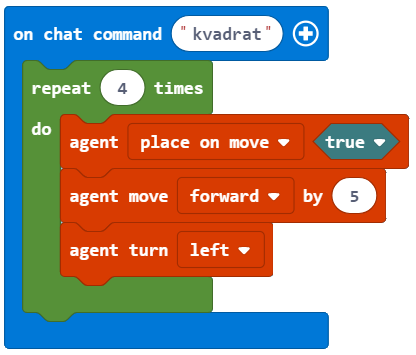
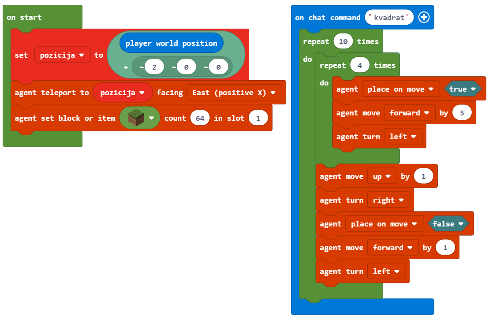

Detyrë - Pillar
========================

Ngjashëm me mënyrën sesi është në natyrë (ndryshimi i stinëve, qarkullimi i ujit, dita dhe nata, ngritja dhe rënia e nivelit të detit, etj.), Në programim mund të përsërisim hapa të caktuar disa herë. Ashtu si në natyrë, në programim, është e nevojshme të drejtoni pjesë të një programi disa herë për të përfunduar detyra të caktuara. Për këto lloje të programeve, ne themi se ato përmbajnë përsëritje, dhe këto përsëritje quhen **cikle**.

Ne do të demonstrojmë përsëritjen duke krijuar një shtyllë në formë katrore, baza e së cilës është një shesh me anët e 5 blloqeve në gjatësi dhe 10 në lartësi.
Në Minecraft, ne gjithashtu mund të përdorim një **agjent** për kryerjen e veprimeve të caktuara, të tilla si mbjellja dhe korrja, minierat, prerja e pemëve dhe ndërtimi i objekteve. Blloqet që kanë të bëjnë me agjentin gjenden në kategorinë |Agent|:

.. |Agent| image:: ../_images/_imageMinecraft/s2.png
              :width: 100px

.. image:: ../_images/_imageMinecraft/s5.png
      :align: center

**Hapi 1.**

Të menduarit për detyrën: Kalimi përpara 5 blloqeve dhe kthimi majtas dhe djathtas (me kënd 90 gradë) krijon një bazë në formë katrore. Lëvizja në boshtin z mundëson ndërtimin e kullës së lartë prej 10 blloqesh.

**Hapi 2**

Hapni ``Code Builder`` (duke shtypur butonin ``C``); do të shfaqet një dritare redaktori ku mund të vendosni blloqe.

Ne do ta ndajmë këtë detyrë në tre pjesë:

- Ne e vendosim agjentin në një pozicion specifik në botë dhe i japim mjete për ndërtimin e objektit të dëshiruar,

- krijimin e bazës katrore të shtyllës,

- krijimi i anës vertikale të shtyllës.

Për të vendosur agjentin ku duam, do të përdorim bllokun |chat|. Futja e fjalës **come** bëhet shkas për vendosjen e agjentit në vendin e dëshiruar. Ne përdorim bllokun |teleport| dhe formojmë kategorinë |Agent| për të vendosur agjentin në vendin e dëshiruar. Ne do ta vendosim agjentin në pozicionin e karakterit tonë (lojtar) lëvizur dy blloqe (hapa) në të majtë. Për ta arritur këtë, ne do të përdorim variablin **position**, i cili ruan vlerën aktuale të pozicionit të personazhit (lojtarit).

.. |chat| image:: ../_images/_imageMinecraft/s7.png
.. |teleport| image:: ../_images/_imageMinecraft/s6.png
              :width: 450px

Do të krijojmë ndryshoren **position** në kategorinë ``Variable``:

Në fillim, vlera e ndryshores **postion** është pozicioni aktual i personazhit në botë lëvizur dy blloqe në të majtë.
Ne do të përcaktojmë vlerën fillestare me bllokun |start| Kjo do të thotë se çdo herë që fillon programi, Minecraft vendos vlerën e pozicionit në vendin e dëshiruar (agjenti lëvizet dy blloqe në të majtë nga karakteri (lojtari)), dhe ne mund të fillojmë ndërtimin e bazës katrore të shtyllës.

Nga kategoria ``Variables`` ne tërheqim bllokun |set|, në të cilin do të futim bllokun që na jep pozicionin aktual të lojtarit të zhvendosur dy blloqe në të majtë.

.. |set| image:: ../_images/_imageMinecraft/s8.png

Kjo mund të arrihet në mënyrën e mëposhtme, duke përdorur bllokun:

.. image:: ../_images/_imageMinecraft/62.png
      :align: center

nga kategoria |Position|.

Në pjesën e sipërme të bllokut, ne do të tërheqim bllokun |world|, i cili jep pozicionin aktual të personazhit (lojtarit) nga kategoria | Player| Në pjesën e poshtme të bllokut, në fushën e hyrjes së koordinatave x, do të vendosim numrin 2.

.. |Player| image:: ../_images/_imageMinecraft/42_.png
            :width: 150px

Shihni bllokun ``on start``:

.. image:: ../_images/_imageMinecraft/63.png
      :align: center

Për ta vendosur agjentin në vendin e dëshiruar, do të përdorim agjentin e bllokut |teleport| nga kategoria |Agent|. Ne do ta vendosim ndryshoren **position** në bllokun e parë të argumenteve, dhe në bllokun e dytë të argumenteve, do të zgjedhim * East (X positive)** nga lista rënëse.

Pamja e kodit:

.. image:: ../_images/_imageMinecraft/65.png
      :align: center

**Hapi 3.**

Ne e testojmë programin duke klikuar butonin |Play|:

.. |Play| image:: ../_images/_imageMinecraft/15.png
          :width: 40px

.. image:: ../_images/_imageMinecraft/64.png
          :align: center

Në mënyrë që agjenti të jetë në gjendje të krijojë blloqe, duhet të sigurohemi që ai ka gjithçka që nevojitet për ndërtimin e shtyllave në inventarin e tij. Për këtë, ne do të përdorim bllokun |setagent| nga kategoria |Agent|:

.. |setagent| image:: ../_images/_imageMinecraft/s14.png
          :width: 350px

**E rëndësishme:** Inventari, i cili hapet duke shtypur butonin ``E``, përdoret nga lojtari për të menaxhuar artikujt që zotëron (mbart). Ai përbëhet nga lojëra elektronike 1 deri në 9 në të cilat mund të "ruajë" sendet që i duhen për të krijuar objekte të ndryshme.
Tani duhet të krijojmë bazën në formë katrore të shtyllës. Në mënyrë që agjenti të jetë në gjendje të krijojë bazën katrore, na duhet një lloj "shkas" për atë ngjarje. Për këtë, ne do të përdorim chat dhe fjalën katror.

Për ta vendosur bllokun në një formë katrore, me gjatësinë prej 5 blloqeve, ne do të përdorim bllokun |repeat| nga kategoria |Loops|.

.. |repeat| image:: ../_images/_imageMinecraft/s10.png
.. |Loops| image:: ../_images/_imageMinecraft/2_.png
          :width: 100px

Një katror është një figurë gjeometrike e përbërë nga katër anët me gjatësi të barabartë, me anët e kundërta paralele dhe kënde midis palëve ngjitur 90 gradë. Katrori ka katër anët, kështu që ne do të futim numrin ``4`` në bllokun e përsëritjes:

.. image:: ../_images/_imageMinecraft/66.png
          :align: center

Për të mundësuar që agjenti të vendosë blloqe duke lëvizur në botë, duhet të përdorim bllokun |placeagent| nga kategoria |Agent|.

Që ajo të jetë në gjendje të kryejë veprimin, duhet të vendosim bllokun e dytë të argumentit në ``true``:

.. image:: ../_images/_imageMinecraft/67.png
          :align: center

Gjatësia e brinjës, e cila është 5 blloqe, do të përcaktohet me bllokun |move| nga kategoria |Agent|:

.. |move| image:: ../_images/_imageMinecraft/s12.png

.. image:: ../_images/_imageMinecraft/68.png
          :align: center

Gjatësia e brinjës, e cila është 5 blloqe, do të përcaktohet me bllokun |move| nga kategoria |Agent|:

Ne mund ta testojmë programin duke shypyr butonin |Play|.

.. image:: ../_images/_imageMinecraft/71.png
          :align: center

Pasi të përfundojë testimi, mund të shohim që agjenti nuk ndërtoi tërë sheshin.

Për ta arritur këtë, duhet të lëvizim agjentin. Ne mund ta bëjmë këtë duke prezantuar bllokun |move| dhe zgjedhja e opsionit ``lart`` nga lista rënëse. Ne e lëvizim agjentin për një bllok, për këtë duhet të vendosim ``1`` si vlerë të parametrit të tretë:

.. image:: ../_images/_imageMinecraft/73.png
          :align: center

Tani do ta testojmë programin përsëri, dhe kësaj radhe do të marrim një shesh:

.. image:: ../_images/_imageMinecraft/72.png
          :align: center

Bazuar në kodin e mësipërm, mund të shohim që agjenti nuk është në pozicion, që është një bllok mbi pozicionin fillestar. Për ta vendosur agjentin në pozicionin e dëshiruar do të prezantojmë dy blloqe |turn| dhe |move|:

.. image:: ../_images/_imageMinecraft/74.png
          :align: center

Gjatë testimit të programit, ne mund të shohim që agjenti largohet nga blloku pasi lëvizja të ketë përfunduar. Ne nuk duam që kjo të ndodhë. Kjo është arsyeja pse ne prezantojmë dy blloqe, të cilat do ta vendosin agjentin pa bllok në pozicionin për ndërtimin e murit:

.. image:: ../_images/_imageMinecraft/75.png
          :align: center

Ajo që mbetet për ne të bëjmë është të krijojmë programin për ndërtimin e shtyllës, e cila do të jetë e lartë 10 blloqe.

Ne mund ta bëjmë këtë duke prezantuar një cikël të ri, ku do të futim ciklin e përfunduar tashmë (i cili krijon katrorin). Ne do të prezantojmë bllokun |repeat| dhe vendosni vlerën e numërsuesit në ``10``:

Vendosja e një cikli brenda trupit të një cikël tjetër quhet **fole**.

.. image:: ../_images/_imageMinecraft/77.png
          :align: center

Pamja përfundimtare e kodit, e cila do të mundësojë ndërtimin e një shtylle e cila është 10 blloqe e lartë dhe ka një bazë katrore 5x5:

**Hapi 3**

Testo programin.
Kliko butonin |Play|.

.. image:: ../_images/_imageMinecraft/76.png
          :align: center

Në këtë mënyrë, ne kemi krijuar një shtyllë e cila është 10 blloqe e lartë dhe ka një bazë katrore 5x5.
