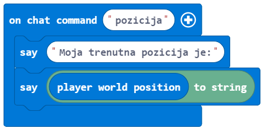

Detyrë - Mbjellja e pemëve
===================================

Ngjarjet janë dukuri, të cilat zakonisht janë rezultat i diçkaje që bëri përdoruesi (klikimi i mouse, shtypja e tasteve në tastierë, zvarritja dhe rënia, etj.). Një ngjarje shkakton një reagim. Një ngjarje në shkencën e kompjuterit është një veprim i zbuluar (realizuar) nga një kompjuter. Për shembull, duke klikuar mouse, ne hapim një aplikacion, kur fillon të bjerë shi njerëzit me çadra të hapura.
Në programim, një mbajtës i ngjarjeve është pjesë e programit (funksionit) i cili aktivizohet si rezultat i ndonjë ngjarje. Në mbajtësit e ngjarjes MakeCode janë blloqe që zakonisht fillojnë me fjalën **on**:

.. image:: ../_images/_imageMinecraft/31.png
      :align: center

Ne do të përdorim një ngjarje për të simuluar mbjelljen e pemëve dhe për të shfaqur pozicionin aktual të personazhit në botën e Minecraft, duke shtuar komandën **position**.

**Faza 1.**

**Të menduarit për detyrën** Karakteri ndërvepron me botën duke lëvizur rreth, mbillen pemë. Karakteri mbjell pemë duke lëvizur nëpër botën e Minecraft. Dërgimi i një mesazhi (përmes chat) tregon pozicionin aktual të personazhit.

**Faza 2**

Hapni ``Code Builder`` (duke shtypur butonin ``C``); do të shfaqet një dritare redaktori ku mund të vendosni blloqe.

Për të filluar bisedën, ose më saktë, për të nxitur një ngjarje e cila do të shfaq pozicionin aktual të personazhit, duhet të tërheqim bllokun |onchat| nga kategoria |Basic| në sipërfaqen e punës, dhe më pas shtypni fjalën **position** në fushën e hyrjes së këtij blloku.

.. |onchat| image:: ../_images/_imageMinecraft/40.png
              :width: 250px

.. |Basic| image:: ../_images/_imageMinecraft/40_.png

Brenda këtij blloku, duhet të shtojmë blloqe që do të thonë pozicionin aktual. Për të thënë ndonjë mesazh (psh. Pozicioni im aktual është:) duhet të përdorim bllokun |say| nga kategoria |Player|

Pozicioni i personazhit (lojtarit) ruhet në bllokun | position| nga kategoria |Player| Meqenëse duam të shfaqim pozicionin e luajtësit në chat, duhet të përdorim bllokun |string| formoni kategorinë |Pozicija|. Në vend të opsionit ``position``, ne do të futim bllokun |position| në fushë:

.. |say| image:: ../_images/_imageMinecraft/27.png
.. |Player| image:: ../_images/_imageMinecraft/27_.png

.. |string| image:: ../_images/_imageMinecraft/41_.png
.. |Pozicija| image:: ../_images/_imageMinecraft/0.png

Le ta testojmë këtë pjesë të kodit duke klikuar butonin |Play|

Pas testimit të programit, ne mund të shohim se kemi marrë atë që donim. Kur përdoruesi shtyp butonin ``T``, hap bisedën dhe shkruan në mesazh **pozicionin**, pozicioni aktual i lojtarit në botë do të shfaqet.

.. |Play| image:: ../_images/_imageMinecraft/15.png
          :width: 40px

.. image:: ../_images/_imageMinecraft/43.png
          :align: center

.. image:: ../_images/_imageMinecraft/42.png
          :align: center

Tani duhet të krijojmë një ngjarje për personazhin, e cila do t'i mundësojë asaj të mbjellë pemë në botën e Minecraft me lëvizjen e saj. Kjo do të arrihet me bllokun |walk|. Nga lista drop-down e këtij blloku ne do të zgjedhim opsionin ``walk``:

.. |walk| image:: ../_images/_imageMinecraft/1_.png

.. image:: ../_images/_imageMinecraft/44.png
          :align: center

Dhe së fundi, duhet të vendosim bllokun |place| nga kategoria |Blocks| brenda këtij blloku. Ne e përdorim këtë bllok për të vendosur (ose në rastin tonë bimë) një pemë. Nga lista drop-down e këtij blloku ne do të zgjedhim bllokun i cili përfaqëson një pemë:

.. |Blocks| image:: ../_images/_imageMinecraft/33_.png

.. image:: ../_images/_imageMinecraft/46.png
          :align: center
          :width: 450px

Në pjesën ``at`` të bllokut, ku duhet të përcaktojmë pozicionin e bllokut që duam të vendosim në botë, do t’i lëmë të tre vlerat të jenë 0 |nula|. Kjo do të lejojë që pemët të mbillen në të njëjtin plan karakteri është i vendosur.

Pas të gjitha ndryshimeve, pjesa e kodit për mbjelljen e pemëve është paraqitur në figurën më poshtë:

.. |nula| image:: ../_images/_imageMinecraft/47.png

.. image:: ../_images/_imageMinecraft/49.png
          :align: center

**faza 3**
Testo programin.
Kliko butonin |Play|.

.. image:: ../_images/_imageMinecraft/48.png
          :align: center

Pasi të kemi testuar programin, mund të konkludojmë se bëri atë që donim. Personazhi po mbjell e pemë duke lëvizur përreth.
