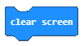
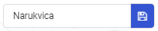

==============================
Detyrë - Byrzylyku
==============================

Në një shkollë fillore, në fund të klasës së dytë, nxënësit u paraqesin prindërve të tyre atë që mësuan gjatë klasës së dytë. Gjatë ngjarjes, disa studentë duhet të mbajnë rrathë, të cilat duhet të shfaqin lule kur studentët që i veshin lëvizin duart.

Një byzylyk, i cili shfaq lule mund të bëhet duke përdorur një pajisje Micro:bit. Shfaqja e luleve do të simulohet nga LED që ndizen dhe fiken çdo herë që përdoruesi lëviz dorën e tij / saj.

.. image:: ../_images/_imageMicroBit/Narukvica1.png
      :align: center

Për të bërë byzylyk, do t'ju duhet:

- 1 Micro:bit
- Pëlhurë ose letër dekorative
- Gërshërë
- Shirit ngjitës / Thread

Është e nevojshme të programoni Micro:bit për të treguar një lule në ekranin e tij (rrjet 5 LED LED) sa herë që përdoruesi shtrëngon dorën e tij / saj.

**Hapi 1**

Shkoni në https://makecode.microbit.org/.

Ne duam të krijojmë një program, i cili do të lejojë që ekrani Micro:bit të tregojë një lule sa herë që bëhet një lëvizje, më saktë, ne duam të regjistrojmë çdo lloj lëvizjeje me pajisjen Micro:bit duke përdorur përshpejtimin e tij. Ekrani nxjerr pamjen e dëshiruar (duke ndezur LED) vetëm kur zbulohet një lëvizje.

Për zgjidhjen e kësaj detyre, ne do të përdorim një nga blloqet e kushtëzuar (blloqet degëzuese) me kushtin që të jetë bërë një lëvizje. Cila linjë (degë) e kodit do të përdoret nëse varet nëse kushti është përmbushur apo jo. Nëse një lëvizje është regjistruar, pajisja Micro:bit do të shfaqë një lule, dhe nëse jo, LED do të qëndrojnë të fikur.

**Hapi 2**

Filloni një projekt të ri dhe tërhiqni bllokun |if..then| nga kategoria |Logic| në bllokun |forever|, të vendosura në kategorinë |Basic|.

.. |forever| image:: ../_images/_imageMicroBit/s1.png
.. |Basic| image:: ../_images/_imageMicroBit/s2.png
.. |if..then| image:: ../_images/_imageMicroBit/s3.png

Blloqet e vendosura brenda bllokut ``foever`` do të funksionojnë derisa të fiket Micro:bit.

Zvarrit bllokun |uslov1| (vendosur në kategorinë |Input|) në fushën hyrëse për gjendjen |uslov|.

.. |uslov| image:: ../_images/_imageMicroBit/s5.png
.. |Input| image:: ../_images/_imageMicroBit/s6.png
.. |uslov1| image:: ../_images/_imageMicroBit/s7.png

Nga lista drop-down e bllokut |uslov1|:

.. image:: ../_images/_imageMicroBit/s8.png
      :align: center

zgjidh opsionin |shake|. Ky opsion regjistron lëvizjet. 

.. |shake| image:: ../_images/_imageMicroBit/s9.png

.. image:: ../_images/_imageMicroBit/s10.png
      :align: center

Bazuar në vendosjen e detyrës, një lule do të shfaqet në Micro:bit kur të jetë regjistruar një lëvizje (d.m.th. në rastin tonë kur kushti është përmbushur). Është e nevojshme të tërhiqni blloqet për shfaqjen e luleve (të cilat ndizni LED të veçantë) nga kategoria ``Basic`` në degë (kushti i përmbushur, ose dega YES):

.. image:: ../_images/_imageMicroBit/s12.png
      :align: center

Ne do të përdorim tre blloqe ``show led`` për shfaqjen e luleve. Këto blloqe do të përdoren për të shfaqur imazhin e dëshiruar të një lule.
Pamja e programit kur është bërë një lëvizje:

.. image:: ../_images/_imageMicroBit/s13.png
      :align: center

Bazuar në vendosjen e detyrës, ekziston gjithashtu një kusht që thotë se nëse një lëvizje nuk është regjistruar, asgjë nuk duhet të shfaqet në Micro:bit. Për ta arritur këtë, duhet të shtojmë një degë, e cila do të ekzekutojë blloqe të caktuara kur kushti nuk është përmbushur (në rastin tonë, kur nuk ka lëvizje). Ne mund ta shtojmë këtë degë duke klikuar në shenjën |plus|. Në këtë degë do të shtojmë bllokun |clear|, i cili përdoret për të pastruar ekranin Micro:bit.

.. |plus| image:: ../_images/_imageMicroBit/s15.png

Pamja finale e byrzylykut:

.. image:: ../_images/_imageMicroBit/s16.png
      :align: center

Stimulimi:

      .. image:: ../_images/_imageMicroBit/s17.png
            :align: center

**Hapi 3**

Shkarkoni skedarin .hex në kompjuterin tuaj duke klikuar në butonin |dugme1| ose butonin |dugme2|. Micro bit do të jetë gati për të filluar punën pasi të keni tërhequr skedarin mbi të.

.. |dugme2| image:: ../_images/_imageMicroBit/29.png
      :width: 199px

Kur të përfundoni programimin e Micro:bit, vendoseni në rastin e bërë tashmë me byzylyk dhe filloni ta përdorni.

Byzylyku:

.. image:: ../_images/_imageMicroBit/Narukvica2.png
      :align: center
