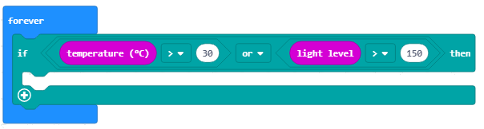
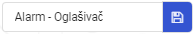

===============================
Detyrë - Alarmi i shtëpisë
===============================

Alarmet janë pajisje që komunikojnë me njësinë qendrore të kontrollit përmes një rrjeti elektronik dhe dërgojnë sinjale në lidhje me lëvizjet dhe ndryshimet e mundshme, të cilat zbulohen nga sensorët.

Një sistem tipik i alarmit në shtëpi përmban përbërësit e mëposhtëm:

- Paneli i kontrollit, i cili është në të vërtetë njësia qendrore e kontrollit të sistemit të alarmit

- Sensorë në dyer, dritare ose disa pjesë të mobiljeve

- Sensorë lëvizjeje, të brendshëm dhe të jashtëm

- Një sirenë apo alarm shumë i zhurmshëm.

Parimi i funksionimit është shumë i thjeshtë: sistemet e alarmit sigurojnë pikat e hyrjes, d.m.th. vendet që lejojnë hyrjen në një shtëpi, apartament ose hapësirë ​​pune, duke përdorur sensorë, të cilët komunikojnë me njësinë kryesore të kontrollit. Sensorët zakonisht vendosen në dyer ose dritare, por edhe në hapje të tjera që lejojnë hyrjen brenda.

Pajisja House Alarm duhet të zbulojë lëvizjen, si dhe ndryshimet e nivelit të temperaturës dhe nivelit të dritës në dhomën e caktuar. Nëse dera hapet dhe temperatura e dhomës ose intensiteti i dritës rritet, pajisja do të bëjë një tingull.

Për të bërë Alarmin e Shtëpisë, do të na duhen:

- 3 Micro:bit

- shirit ngjitës

- altoparlantë ose kufje

- Klipet e krokodilit

Për të krijuar pajisjen House Alarm, së pari, do të duhet të bëjmë pajisjen aktuale (fizike) të përbërë nga Micro:bit, i cili do të shërbejë si një sensor lëvizjeje, Micro:bit i cili do të zbulojë ndryshimin në temperaturën e dhomës dhe nivelin e dritës, dhe Micro:bit i cili do të bëjë një tingull kur të zbulohen ndryshimet (Micro:bit i lidhur me altoparlantët ose kufjet duhet të vendoset rreth 10 metra nga sensori).

Tani që kemi bërë pajisjen House Alarm, duhet të krijojmë programe për secilin Micro:bit.

Duhet të programojmë secilin Micro:bit veç e veç:

1. E para duhet të zbulojë lëvizjen.
2. E dyta zbulon ndryshimet në temperaturë dhe nivelin e dritës.
3. E treta prodhon një tingull kur lëvizja, ndryshimet në temperaturën ose nivelin e dritës zbulohen në dhomë.

**Hapi 1**

Vizito https://makecode.microbit.org/.

First, we will program the Micro:bit that serves as the motion detector.

**Hapi 2**

Krijoni një projekt të ri.

Tani, ne duam të programojmë zbulimin e lëvizjes; më konkretisht, ne duam të regjistrojmë lëvizjen duke përdorur Micro:bit.

Kur duam të krijojmë komunikim (për të përdorur komunikimin radio) midis Micro:bitëve, të gjitha të përfshira Micro:bit duhet t'i përkasin të njëjtit grup, d.m.th. duhet të përdorin të njëjtin ID të grupit.

**Hapi 3**

Duke krijuar ID-në e grupit, ne në fakt krijojmë një hapësirë ku pajisjet do të komunikojnë.

Për të krijuar një grup ID, duhet të tërheqim bllokun |radioset| nga kategoria |Radio| në bllokun |onstart| nga kategoria |Basic|. Në hapësirën |ID| shtypni numrin e dëshiruar për ID të grupit. Ky mund të jetë çdo numër. Do ta lëmë numrin 1. Në këtë mënyrë, ne kemi krijuar grupin me ID 1 në të cilin do të komunikojnë të gjitha Micro:bitet.

.. |Radio| image:: ../_images/_imageMicroBit/s21.png
.. |radioset| image:: ../_images/_imageMicroBit/s22.png
.. |Basic| image:: ../_images/_imageMicroBit/s2.png
.. |ID| image:: ../_images/_imageMicroBit/s23.png
.. |onstart| image:: ../_images/_imageMicroBit/onstart.png

Pjesa e kodit, e cila krijon grupin për komunikim:

.. image:: ../_images/_imageMicroBit/s24.png
      :align: center

**Hapi 4**

Tërhiq bllokun |if..then| nga kategoria |Logic| në bllokun |forever|, nga kategoria |Basic|.

.. |forever| image:: ../_images/_imageMicroBit/s1.png
.. |if..then| image:: ../_images/_imageMicroBit/s3.png
.. |Logic| image:: ../_images/_imageMicroBit/s4.png

Në fushën e hyrjes së kushteve |uslov| tërhiqeni bllokun |uslov1| (vendosur në kategorinë |Input|).

.. |uslov| image:: ../_images/_imageMicroBit/s5.png
.. |Input| image:: ../_images/_imageMicroBit/s6.png
.. |uslov1| image:: ../_images/_imageMicroBit/s7.png

Nga lista drop-down e bllokut |uslov1|:

.. image:: ../_images/_imageMicroBit/s8.png
      :align: center

zgjidh opsionin |shake|. Ky opsion dikton lëvizjet.

.. |shake| image:: ../_images/_imageMicroBit/s9.png

.. image:: ../_images/_imageMicroBit/s10.png
      :align: center

Bazuar në vendosjen e detyrës, kur një lëvizje është e regjistruar (ose në rastin tonë kur plotësohen kushtet), Micro:bit do të dërgojë një vlerë të caktuar duke përdorur bllokun |radiosend|

Ne do ta vendosim numrin 5 në fushën e hyrjes |broj| (çdo vlerë mund të futet). Që sensori të reagojë, d.m.th të zbulojë lëvizjen, duhet ta vendosim në mënyrë që të duhet një kohë e caktuar, le të vendosim 3 sekonda (ose 3000 milisekonda). Për këtë, ne do të përdorim bllokun |time| nga kategoria |basic|. Në fushën e hyrjes |vreme| ne do të vendosim 3000ms, që do të jetë koha e reagimit të sensorit, në lidhje me ndryshimin që ka ndodhur.

.. |broj| image:: ../_images/_imageMicroBit/s32.png
.. |vreme| image:: ../_images/_imageMicroBit/s40.png
.. |time| image:: ../_images/_imageMicroBit/s39.png
.. |radiosend| image:: ../_images/_imageMicroBit/s30.png

.. image:: ../_images/_imageMicroBit/s48.png
      :align: center

**Hapi 5**

Shkarkoni skedarin .hex në kompjuterin tuaj duke klikuar në butonin |dugme1| ose butonin |dugme2|. Micro:bit do të jetë gati për të filluar punën pasi të keni tërhequr skedarin mbi të.

.. |dugme1| image:: ../_images/_imageMicroBit/s49.png
.. |dugme2| image:: ../_images/_imageMicroBit/29.png
      :width: 199px

**Hapi 6**

Tani, duhet të programojmë Micro: bit për të zbuluar ndryshimet në temperaturë dhe nivelin e dritës, dhe për ta dërguar atë informacion në Micro:bit, i cili do të reagojë ndaj kësaj duke bërë një tingull.
Në mënyrë që Micro:bitet të komunikojnë, ato duhet t'i përkasin të njëjtit grup ID.

Tashmë kemi krijuar grupin me ID 1, ku të gjitha Micro:bitet tona do të komunikojnë:

.. image:: ../_images/_imageMicroBit/s24.png
      :align: center

Tërhiq bllokun |if..then| formoni kategorinë |Logic| në bllokun |forever|. Ne gjithashtu duhet të tërheqim blloqet që përcaktojnë kushtet në fushën e hyrjes së kushteve |uslov|. Një kusht do të jetë që temperatura të jetë më e lartë se 30 gradë, dhe kushti tjetër do të jetë që niveli i dritës të jetë më i lartë se 150.

Kushtet mund të jenë komplekse (të krijuara duke lidhur kushte të thjeshta).

Në rastin tonë, kushtet e thjeshta janë që temperatura të jetë më e lartë se 30, ose që niveli i dritës të jetë më i lartë se 150.

.. |poredjenje| image:: ../_images/_imageMicroBit/s53.png

Ne përcaktojmë kushtet tona të thjeshta me bllokun |poredjenje|.

Në rastin tonë, ne përcaktojmë kushtet si më poshtë:

- temperatura |temperatura| më i lartë se 30: |vece30|.

- Nivel i lartë |intenzitet| më i lartë se 150: |vece150|.

.. |temperatura| image:: ../_images/_imageMicroBit/s55.png
.. |intenzitet| image:: ../_images/_imageMicroBit/s54.png
.. |vece30| image:: ../_images/_imageMicroBit/s56.png
.. |vece150| image:: ../_images/_imageMicroBit/s57.png

Ju përdorni operatorë logjikë (boolean) për të lidhur kushte të thjeshta (AND, OR, NOT).

Në MakeCode, operatorët logjikë (boolean) përfaqësohen si më poshtë:

|and| - Lidh dy kushte dhe kthehet si rezultat True vetëm nëse të dyja kushtet janë të vërteta.

|or| - Lidh dy kushte dhe kthehet si rezultat True nëse të paktën një kusht është i vërtetë.

|not| - Vendoset para një kushti dhe kthehet True në rast se kushti nuk përmbushet.

.. |and| image:: ../_images/_imageMicroBit/s50.png
.. |or| image:: ../_images/_imageMicroBit/s51.png
.. |not| image:: ../_images/_imageMicroBit/s52.png

Gjendja, e cila kontrollon nëse ka pasur një ndryshim në temperaturën ose nivelin e dritës, përcaktohet nga blloku i mëposhtëm:

.. image:: ../_images/_imageMicroBit/s58.png
      :align: center

Pamja e bllokut të kushteve:

.. image:: ../_images/_imageMicroBit/s60.png
      :align: center

Bazuar në konfigurimin e detyrës, kur është regjistruar ndryshimi i temperaturës ose nivelit të dritës, Micro:bit do të dërgojë një vlerë të caktuar duke përdorur bllokun |radiosend| Ne do të vendosim numrin 10 në fushën hyrëse |broj| (çdo vlerë mund të futet). Që sensori të reagojë, d.m.th të zbulojë ndryshimet, duhet ta vendosim në mënyrë që të duhet një kohë e caktuar, le të vendosim 3 sekonda (ose 3000 milisekonda). Për këtë, ne do të përdorim bllokun |time| nga kategoria |Basic|. Në fushën e hyrjes |vreme| ne do të vendosim 3000ms, që do të jetë koha e përgjigjes së sensorit, në lidhje me ndryshimin që ka ndodhur.

Pamja e programit kur zbulohet një ndryshim në temperaturë ose nivelin e dritës:

**Hapi 7**

Shkarkoni skedarin .hex në kompjuterin tuaj duke klikuar në butonin |dugme1| ose butonin |dugme2|. Micro:bit do të jetë gati për të filluar punën pasi të keni tërhequr skedarin mbi të.

.. |dugme11| image:: ../_images/_imageMicroBit/s61.png
.. |dugme21| image:: ../_images/_imageMicroBit/29.png
      :width: 199px

**Hapi 8**

Shkarkoni skedarin .hex në kompjuterin tuaj duke klikuar në butonin |dugme1| ose butonin |dugme2|. Micro:bit do të jetë gati për të filluar punën pasi të keni tërhequr skedarin mbi të.

Do krijojmë një grup me ID 1:

.. image:: ../_images/_imageMicroBit/s24.png
      :align: center

Hapi tjetër për këtë Micro:bit është të marrë informacion (në rastin tonë një numër) mbi bazën e të cilit do të "përgjigjet" duke bërë një tingull. Për ta arritur këtë, ne do të tërheqim bllokun e mëposhtëm nga kategoria |Radio|:

.. image:: ../_images/_imageMicroBit/s30.png
      :align: center

Në të, ne do të tërheqim bllokun |if..then| Në fushën e hyrjes së kushteve |uslov| duhet të tërheqim gjendjen, e cila do të kontrollojë numrat (5, 10) të marrë nga dy Micro:bit të tjera.

Përdorimi i shenjës |plus|, do të prezantojë edhe një kusht. Në degën me kushtin |uslov5| dhe në degën me kushtin |uslov10|, do ta tërheqim bllokun |melodija| (nga lista drop-down e këtij blloku do të zgjedhim melodinë ``ringtone``) nga kategoria |Music|, e cila përdoret për prodhimin e tingullit.
Përveç këtij blloku, ne do të shtojmë edhe një interval kohor prej një sekonde.

.. |plus| image:: ../_images/_imageMicroBit/s15.png
.. |uslov5| image:: ../_images/_imageMicroBit/s63.png
.. |uslov10| image:: ../_images/_imageMicroBit/s64.png
.. |melodija| image:: ../_images/_imageMicroBit/s65.png
.. |Music| image:: ../_images/_imageMicroBit/s66.png

Pamja finale e kodit:

.. image:: ../_images/_imageMicroBit/s67.png
      :align: center

**Shënim**: Micro:bit duhet të jetë i lidhur me altoparlantët ose kufjet, siç tregohet në figurën më poshtë, që tingulli të riprodhohet:

.. image:: ../_images/_imageMicroBit/34.png
      :align: center

**Hapi 9**

Shkarkoni skedarin .hex në kompjuterin tuaj duke klikuar në butonin |dugme1| ose butonin |dugme2|. Micro:bit do të jetë gati për të filluar punën pasi të keni tërhequr skedarin mbi të.

.. |dugme02| image:: ../_images/_imageMicroBit/29.png
      :width: 199px
