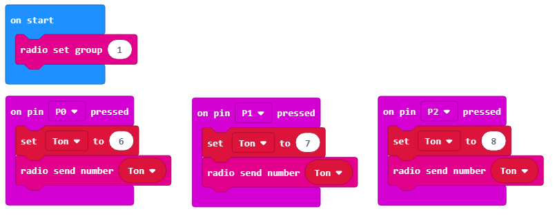
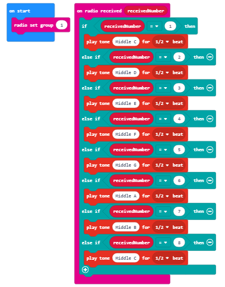

===================================
Detyrë - Frutat që këndojnë
===================================

Një ton paraqet një lëvizje të rregullt dhe të barabartë të një burimi të shëndoshë.

Një ton është një tingull, i cili ka një specifik:

1. ritmi - përcaktohet nga shpejtësia dhe numri i dridhjeve në sekondë. Sa më i lartë numri i dridhjeve, aq më i lartë është tingulli dhe anasjelltas. Veshi i njeriut mund të dëgjojë nga 16 (tonin më të ulët që veshi ynë mund ta dallojë) deri në 20 000 (toni më i lartë që veshi ynë mund të dallojë) dridhjet / sekondën.

2. intensiteti - varet nga madhësia e amplituda e burimit të tingullit. Sa më i madh amplituda, aq më i lartë tingulli. Intensiteti i tonit ndikohet gjithashtu nga fusha. Tonet më të thella dëgjohen dukshëm më pak se tonet më të larta.

3. kohëzgjatja - varet nga sa kohë dridhet burimi i zërit. Kur qetësohet, tingulli ndalon.

4. ngjyra - varet nga lloji i materialit, forma dhe madhësia e burimit të tingullit vibrues.

Do të bëjmë një instrument muzikor duke përdorur pajisjen Micro: bit, dhe do ta përdorim për të luajtur në një shkallë (muzikore).

Një shkallë (muzikore) paraqet një seri prej tetë tone radhazi (shtatë tone me emra të ndryshëm, dhe e teta që është emri i përsëritur i të parës) të rregulluar në oktava. Tonet në një shkallë mund të lexohen alfabetikisht ose sipas zgjidhjes. Alfabetikisht, tonet janë: c, d, e, f, g, a dhe h (b në disa vende), dhe sipas solucionit: bëj (ose ut), re, mi, fa, sol (ose ashtu), la , si (ose ti), bëj.
Ne do të përdorim Micro:bit për të prodhuar oktavën C, D, E, F, G, A, H (B).

Për të bërë piano, do të na duhen:

- 4 Micro:bit

- kufje

- klipet e krokodilit

- frutat (8)

- fletë alumini

Në mënyrë që të bëjmë Piano (Singing Fruits), së pari, duhet të përgatisim pajisjen fizike të përbërë nga fruta të ndryshme, mbi të cilat do të luajmë, dhe Micro:bit.

.. image:: ../_images/_imageMicroBit/v4.jpg
      :align: center
      :width: 500px

Micro:bit për frutat (llojet e frutave që kanë shumë lëng) dhe kufjet:

Hapi 1: Ne mund të lidhim Micro:bit e parë duke e lidhur tokëzimin (GND) në kufjet me pin (GND) duke përdorur kapëse të krokodilit. Shifra më poshtë paraqet lidhjen midis tokëzimit dhe Mikro: bit (vetëm për një pajisje). GND është argumentimi, i cili mbron Micro:bit nga goditja elektrike. Ne do ta lidhim atë me një tel, i cili do të shërbejë si tokëzim. Përveç kësaj, ne duhet të lidhim Micro:bit me kufjet përmes PIN0. Ne do t'i lidhim klipet e krokodilit në PIN0 dhe folezën e kufjeve (në krye të saj). Është shumë e rëndësishme të siguroheni që klipet në prizën e kufjeve nuk janë prekëse.

.. image:: ../_images/_imageMicroBit/v3.jpg
      :align: center
      :width: 500px

Hapi 2: Për Micro:bit të dytë, lidhni kapëset e krokodilit në GND dhe tela dhe pastaj lidheni atë me banane (fundi i klipit futet në banane). Lidhni Micro:bit me tre portokall në PIN0, PIN1 dhe PIN2 përmes klipeve të krokodilit.

Hapi 3: Për Micro:bit të tretë lidhni kapëset e krokodilit në GND dhe tela. Ne e lidhim Micro:bit-in me portokallin përmes PIN0 përmes një klipi krokodili. Lidhni dy portokallet me PIN1 dhe PIN2 të Micro:bit duke përdorur kapëse krokodili.

Hapi 4: Për Micro:bit e katërt pak lidhni kapësin e krokodilit në GND dhe tela. Ne e lidhim Micro:bit-in me portokallin përmes PIN0 përmes një klipi krokodili. Lidhni dy portokallet me PIN1 dhe PIN2 të Micro: bit duke përdorur kapëse krokodili.

Tani që kemi ndërtuar pianon (fizike) aktuale, duhet të krijojmë programe për secilin Micro:bit.

**Programimi**

Duhet të programojmë secilin Micro:bit më vete, në mënyrë që ata të komunikojnë dhe prodhojnë tinguj.

**Hapi 1**

Vizitoni https://makecode.microbit.org/.

**Hapi 2**

Krijoni një projekt të ri.
Tani, ne duam të programojmë Micro:bit për të dërguar informacion - numrat përkatës (për tonet përkatëse) kur shtypet një PIN specifik. Për më tepër, ne duhet të programojmë Micro:bit për të komunikuar me njëri-tjetrin. Në këtë mënyrë, në varësi të numrit (tonit) Micro:bitet "prodhojnë", ose më saktë dërgoni, Micro:bit do të marrë atë numër, dhe kufjet do të riprodhojnë tonin e dëshiruar.

**Hapi 3**

Kur duam të krijojmë komunikim (për të përdorur radio komunikimin) ndërmjet Micro:biteve, të gjitha Micro:bit e përfshira duhet t'i përkasin të njëjtit grup, p.sh ata duhet të përdorin të njëjtin ID të grupit. Duke krijuar grupin e identitetit, ne në fakt po krijojmë hapësirën në të cilën pajisjet do të komunikojnë.

Për të krijuar një grup ID, duhet të tërheqim bllokun |radioset| nga kategoria |Radio| në bllokun |onstart| nga kategoria |Basic|. Në hapësirën |ID| shtypni numrin e dëshiruar për ID të grupit. Ky mund të jetë çdo numër. Do ta lëmë numrin 1. Në këtë mënyrë, ne kemi krijuar grupin me ID 1 në të cilin do të komunikojnë të gjitha Micro:bit.

.. |Radio| image:: ../_images/_imageMicroBit/s21.png
.. |radioset| image:: ../_images/_imageMicroBit/s22.png
.. |Basic| image:: ../_images/_imageMicroBit/s2.png
.. |ID| image:: ../_images/_imageMicroBit/s23.png
.. |onstart| image:: ../_images/_imageMicroBit/onstart.png

Pjesa e kodit, e cila krijon grupin për komunikim:

.. image:: ../_images/_imageMicroBit/s24.png
      :align: center

**Hapi 4**

Duhet të shtojmë bllokun |radiosend| në pjesën e kodit, i cili është krijuar për të regjistruar një ngjarje (kur preket fruti), me qëllim dërgimin e sinjalit të radios në një pajisje tjetër në bazë të së cilës kjo pajisje tjetër do të "reagojë", d.m.th. kur të prekim (shtypni) frutat do të dëgjojmë një ton.

Ngjarja do të regjistrohet kur shtypet njëra nga kunjat në Micro:bit. Për ta arritur këtë, duhet të prezantojmë bllokun |onpin| nga kategoria |Input|. Nga lista rënëse e bllokut do të zgjedhim pin (P0, P1, P2), i cili inicon ngjarjen - dërgimin e numrit (tonin) që do të shfaqet.

.. |radiosend| image:: ../_images/_imageMicroBit/s30.png
.. |Input| image:: ../_images/_imageMicroBit/s26.png
.. |onpin| image:: ../_images/_imageMicroBit/s25.png

Duhet të përcaktojmë mënyrën se si do të paraqesim (ruajmë) vlerat e toneve të dëshiruar (Middle C ose 262, D D Middle ose 294, E E Middle ose 330, Middle F ose 349, Middle G ose 392, Middle A ose 440, Middle H (B) ose 494). Përveç kësaj, ne gjithashtu duhet të përcaktojmë vlera për secilën prej shënimeve të përmendura më lart.
Ne mund ta zgjidhim këtë problem duke prezantuar **variablin**.

Një variabël mund të kuptohet si një hapësirë në kujtesën e kompjuterit, diçka si kuti, në të cilën, gjatë ekzekutimit të programit, ne mund të ruajmë disa vlera të përkohshme.
Variablat kanë emra. Kur duam të përdorim vlerën e variablit, mjafton vetëm të përdorim emrin e saj.

Një variabël është krijuar në mënyrën e mëposhtme, në kategorinë Variablat(1), klikoni në butonin Bëni njëvaribël (2) dhe shkruani emrin e asaj variabel në fushën (3), në rastin tonë emrin Tone. Duke klikuar butonin OK (4), ju keni krijuar një Varibël (5).

.. image:: ../_images/_imageMicroBit/s29.png
      :align: center

Vlera e variablës ``Ton`` do të shkojë nga 1 në 8.

Në rast se shtypet ``P1``, ne do të vendosim vlerën fillestare në 1 për variablin ``Tone``, duke përdorur bllokun |setTon|.

.. |setTon| image:: ../_images/_imageMicroBit/n1.png

Ne mund të dërgojmë një sinjal radio në Micro:bit duke përdorur bllokun |radiosend|, tjetër do të tërheqim variablin ``Tone``, të cilën dëshirojmë ta dërgojmë, në pjesën |blok1|, d.m.th. do të krijojmë bllokun |Ton|.

Ne krijojmë bllokun:

.. |blok1| image:: ../_images/_imageMicroBit/s32.png
.. |Ton| image:: ../_images/_imageMicroBit/s33.png

.. image:: ../_images/_imageMicroBit/s34_.png
      :align: center

E njëjta procedurë duhet të përdoret për pinin ``P2``. Sidoqoftë, ne do të vendosim vlerën fillestare të variablit ``Tone`` në 2, nëse shtypet pini ``P2``.

Pamja e kodit për çelësat e pianos (C, D):

.. image:: ../_images/_imageMicroBit/s34.png
      :align: center

Vështrimi përfundimtar i programit, i cili dërgon informacione mbi cilën pin është shtypur (``P1`` ose ``P2``):

.. image:: ../_images/_imageMicroBit/n7.png
      :align: center

Hapi tjetër është për Micro:bit për të marrë informacionin (në rastin tonë një numër) në bazë të të cilit do të "reagojë" dhe do të prodhojë një tingull.

Për këtë, ne do të tërheqim bllokun |onradio| nga kategoria ``Radio``. Në varësi të numrit të marrë (``1`` ose ``2``), ky Micro:bit do të riprodhojë tonin e dëshiruar.

Do të përdorim blloun |ifthen| nga kategoria |Logic| për këtë.

.. |onradio| image:: ../_images/_imageMicroBit/30.png
.. |Logic| image:: ../_images/_imageMicroBit/s4.png
.. |ifthen| image:: ../_images/_imageMicroBit/s3.png

Në fushën e hyrjes së gjendjes ne do të tërheqim bllokun |b1|, i cili përdoret për të kontrolluar nëse pin ``P1`` është shtypur apo jo:

.. |b1| image:: ../_images/_imageMicroBit/n2.png

.. image:: ../_images/_imageMicroBit/n3.png
      :align: center

Nëse shtypni pinin ``P1``, do të dëgjohet toni ``C``. Ne e arrijmë riprodhimin e tonit duke tërhequr bllokun |playton| nga kategoria |Music|, e cila përdoret për të riprodhuar tingullin. Në listën drop-down të këtij blloku do të zgjedhim tonin dhe kohëzgjatjen e tingullit.

.. |playton| image:: ../_images/_imageMicroBit/31_.png
.. |Music| image:: ../_images/_imageMicroBit/s66.png

.. image:: ../_images/_imageMicroBit/3132.png
      :align: center

Pamja e bllokut:

.. image:: ../_images/_imageMicroBit/n4.png
      :align: center

Ne do të shtojmë edhe një kusht më shumë (``P2`` pin i shtypur) në bllokun |ifthen| duke klikuar në shenjën |plus|. Nëse shtypni pinin ``P2``, toni ``D`` do të riprodhohet.

.. |plus| image:: ../_images/_imageMicroBit/s15.png

Pamja e bllokut:

**Shënim**: Micro:bit duhet të jetë i lidhur me altoparlantët ose kufjet, siç tregohet në figurën më poshtë, që tingulli të riprodhohet.

.. image:: ../_images/_imageMicroBit/34.png
      :align: center

Pamja përfundimtare e programit për riprodhimin e toneve ``C`` dhe ``D``:

.. image:: ../_images/_imageMicroBit/n6.png
      :align: center

Shkarkoni skedarin .hex në kompjuterin tuaj duke klikuar në butonin |dugme1| ose butonin |dugme2|. Micro:bit do të jetë gati për të filluar punën pasi të keni tërhequr skedarin mbi të.

.. |dugme1| image:: ../_images/_imageMicroBit/s36.png
.. |dugme2| image:: ../_images/_imageMicroBit/29.png
      :width: 199px

Mbajmë bananen në njërën dorë dhe përdorim dorën tjetër për të luajtur fruta të tjera.

Ne mund të programojmë dy Micro:bitet të mbetura në të njëjtën mënyrë, për tonet e mesme E ose 330, F ose 349, Middle G ose 392, Middle A ose 440, Middle H (B) ose 494.

Kodi përfundimtar i programit për Micro:bit i përdorur për të dërguar informacionin se në cilën pin është shtypur, bazuar në të cilat do të riprodhohen tonet ``E``, ``F`` dhe ``G``:

.. image:: ../_images/_imageMicroBit/n8.png
      :align: center

Pamja përfundimtare e kodit të programit për Micro:bit e përdorur për të dërguar informacionin mbi cilën pin është shtypur, bazuar në të cilat do të jenë tonet ``A``, ``H (B)`` dhe ``C`` riprodhohet:

Pas gjithë kësaj, do të duhet të rifreskoni kodin për Micro:bit i përdorur si tingull "transmetues":

Pasi të kemi lidhur të gjitha frutat dhe të kemi shkarkuar të gjitha kodet, mund të luajmë një këngë të këndshme në pianon tonë të frutave.
