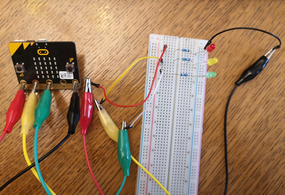
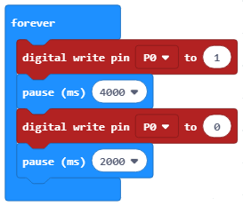

=================================
Detyrë - Semafori
=================================

Një semafor është një pajisje e dritës së sinjalit, dhe ka një rol të rëndësishëm në kontrollin e trafikut. Dritat e trafikut zakonisht instalohen në kryqëzime.

.. image:: ../_images/_imageMicroBit/semafor.jpg
      :align: center

Drita e parë e trafikut u instalua në 10 dhjetor 1868 në Londër; ajo u krijua nga John Peake Knight. Kjo semafor u operua me dorë nga një oficer policie. Dritat e parë të trafikut të ndërlidhur u instaluan në Salt Lake City. Drita e parë e kontrollit automatik të kontrollit u prezantua në Shtetet e Bashkuara të Amerikës, në Huston, në 1922 dhe në 1927 në Angli. Drita e parë e trafikut në Serbi u instalua në Beograd, në kryqëzimin e Rrugës King Alexander, Rrugës King Ferdinand (aktualisht Rruga Kneza Miloša), dhe rruga Takovska, më 4 dhjetor 1939.

Ngjyra, forma dhe madhësia e sinjaleve të dritës në një semafor përcaktohen nga standardet ndërkombëtare:

- ndalo - e kuqe

- përgatituni të vazhdoni - në të njëjtën kohë të kuqe dhe të verdhë

- procedoni - jeshile

- njofton që sinjali do të ndryshojë në të kuqe - të verdhë.

Ngjyrat ndizen dhe fiken sipas një rendi specifik, ose më saktë, në interval të caktuar kohor.

Duke përdorur një Micro: bit ne do të ndërtojmë një semafor me drita të kuqe, të verdhë dhe jeshile që ndizen dhe fiken në interval të caktuar, ashtu si një semafor i vërtetë.

Për të bërë një semafor, do t'ju duhet:

- 1 Micro:bit

- Protoboard

- sfungjer

- 3 dioda (të kuqe, jeshile dhe të verdhë)

- 3 rezistorë

- 4 klipe krokodili

- 4 tela me gjatësi të ndryshme.

Para se të fillojmë lidhjen e Micro:bit me diodat, duhet të kujtojmë se një Micro:bit ka 25 kunja, pesë kunja të mëdha - 0, 1, 2, 3V dhe GND. 20 kunjat e mbetura mund të përdoren për lidhjen e Micro: bit me pajisje të tjera.

.. image:: ../_images/_imageMicroBit/67.png
      :align: center
 
Duke përdorur tela / kapëse krokodili, ne do të lidhim Micro:bit përmes GND me ndonjë nga kunjat në protoboard, kështu që ne mund ta lidhim atë me diodën GND.

Funksionimi i diodës kërkon fuqi; ne do të kufizojmë furnizimin me energji duke përdorur rezistorë (ata sigurojnë disa rezistencë që kufizojnë rrjedhën e rrymës dhe kontrollojnë tensionin në qark).

Figura më poshtë tregon lidhjen e Micro:bit me një nga LED:

.. image:: ../_images/_imageMicroBit/semafor1.png
      :align: center

Ne lidhim Micro bit përmes pin P0 dhe një nga kunjat në protoboard në anën e majtë të rezistorëve (figura më poshtë). Ne do të lidhim pjesën më të gjatë (+) të diodës së dritës me pin P0 duke përdorur kapëse krokodili, dhe ajo më e shkurtër, duke përdorur edhe klipet e krokodilit, në pinin GND (shiko foton më poshtë).

Ne do t'i lidhim dy LED të tjera në të njëjtën mënyrë.

Ne do të përdorim këtë logjikë të lidhjes për të bërë fizikisht një semafor nga sfungjeri.

**Programim** 

Duhet të krijojmë një program, i cili lejon që LED-të të ndizen dhe fiken.

**Hapi 1**

Shkoni në https://makecode.microbit.org/.

**Hapi 2**

Krijoni një projekt të ri.

Tani, ne duam të programojmë diodat që të ndizen dhe fiken.

**Hapi 3**

Për të krijuar një kod, i cili do të lejojë që LED-të të ndizen dhe fiken, duhet të tërheqim bllokun |digital| nga kategoria ``Advanced - Pins`` në bllokun |forever| nga kategoria |Basic|.

.. |forever| image:: ../_images/_imageMicroBit/s1.png
.. |Basic| image:: ../_images/_imageMicroBit/s2.png
.. |digital| image:: ../_images/_imageMicroBit/s37.png

Në mënyrë që drita të ndizet, duhet të vendosim numrin 1 në hapësirë |blokcic|. Nëse vlera është vendosur në 0, drita do të fiket. 

.. |blokcic| image:: ../_images/_imageMicroBit/s38.png

Në lidhje me ndezjen dhe fikjen e dritës, duhet gjithashtu të vendosim një interval kohor brenda të cilit do të ndodhin këto ndryshime.
Do të vendosim që drita të mbetet e ndezur për 4 sekonda, një fikje për 2 sekonda. Për ta arritur këtë, ne do të përdorim bllokun |b1| nga kategoria ``Basic``. Në fushë |b2| ne do të vendosim 4000ms (që është 4 sekonda) që drita të ndizet, dhe 2000 që drita të mbetet e fikur.

.. |b1| image:: ../_images/_imageMicroBit/s39.png
.. |b2| image:: ../_images/_imageMicroBit/s40.png

Pamja finale e kodit të semaforit:

.. image:: ../_images/_imageMicroBit/s42.png
      :align: center

Shkarkoni skedarin .hex në kompjuterin tuaj duke klikuar në butonin |dugme1| ose butonin |dugme2|. Micro:bit do të jetë gati për të filluar punën pasi të keni tërhequr skedarin mbi të

.. |dugme2| image:: ../_images/_imageMicroBit/29.png
      :width: 199px
