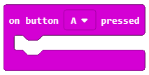

Puna me blloqet nga kategoria Input
============================================

Kompjuteri përpunon të dhënat që merr nga hyrja (nga përdoruesi (duke shtypur një buton, ...) ose mjedisin (vlerat e marra nga leximet e sensorit). Në MakeCode, ekziston një kategori blloqesh që mundëson punën me të dhëna hyrëse, më konkretisht një kategori blloku që lejon një program të "kryejë veprime të caktuara" bazuar në informacionin që merr nga përdoruesi ose ambienti.

|Input| është kategoria që përmban blloqe (komanda), të cilat përpunojnë të dhënat e marra nga përdoruesit (duke klikuar butonat) ose mjedisin (duke lexuar të dhëna shqisore).

.. image:: ../_images/_imageMicroBit/p8.png
      :align: center

Të dhënat hyrëse mund të merren nga shtypja e butonit ``A``, ``B`` ose ``A + B``, si dhe nga leximi i vlerave të sensorëve për dritën, temperaturën dhe aceleratorin.

.. |input| image:: ../_images/_imageMicroBit/s26.png

Ne dëshirojmë të krijojmë një program i cili tregon temperaturën (në gradë Celsius) kur shtypet butoni ``A``.

.. |onstart| image:: ../_images/_imageMicroBit/s20.png

.. |forever| image:: ../_images/_imageMicroBit/s1.png

.. mchoice:: L2Z1
    :answer_a: një herë.
    :answer_b: pafundësisht.
    :feedback_a:Bravo! Blloku në onstart është një nga blloqet nga kategoria Basic, dhe blloqet brenda tij ekzekutohen vetëm një herë gjatë ekzekutimit të programit.
    :feedback_b: Blloku përgjithmonë është blloku brenda të cilit komandat do të ekzekutohen një numër të pafund herë. Drejtimi i këtij blloku nuk do të ndalet kurrë më vete. Për të ndaluar funksionimin e këtij blloku, duhet të shtypni butonin stop (|stop|).
    :correct: a

    Sa herë do të ekzekutohen blloqet brenda bllokut |onstart|?

Siç kemi parë tashmë në shembujt e mësimit të mëparshëm, mënyra se si fillon dhe funksionon programi varet nga cili bllok është përdorur, |onstart| ose |forever|

Për të mundësuar futjen e të dhënave, domethënë të përdorim butonin ``A`` për të filluar ose drejtuar programin, duhet të zgjedhim |onbutton| nga kategoria |input|, dhe nga lista e saj drop-down duhet të zgjedhim butonin A.

Blloku |onbutton| fillon programin dhe ekzekutohen të gjitha blloqet e përfshira në të.

Zvarritim butonin ``on button ... pressed`` mbi sipërfaqen e punës, dhe pastaj vendosim në të bllokun i cili do të na lejojë të shfaqim vlerën e temperaturës.

Për shfaqjen e temperaturës, ne do të përdorim bllokun |shownumber| nga kategoria |Basic|.

.. |shownumber| image:: ../_images/_imageMicroBit/15.png

.. |Basic| image:: ../_images/_imageMicroBit/s2.png

Pas lidhjes së këtyre dy blloqeve, ne do të zgjedhim bllokun |temperature| nga kategoria Input, të cilën do ta tërheqim në fushën hyrëse të komandës së numrit të shfaqjes. Blloku |temperature| ruan vlerën e marrë nga leximi i sensorit të temperaturës, i cili shfaqet në gradë Celsius.

.. |temperatura| image:: ../_images/_imageMicroBit/s55.png

Pamja finale e programit:

.. image:: ../_images/_imageMicroBit/p10.png
      :align: center

Ne do të përdorim simulatorin për të testuar programin. Programi do të ekzekutohet pasi |play| butoni klikohet.

.. |play| image:: ../_images/_imageMicroBit/p3.png

.. mchoice:: L2Z2
    :answer_a: Kur shtypet butoni A, do të shfaqet vlera e nivelit të dritës.
    :answer_b: Kur shtypet butoni B, do të shfaqet vlera e nivelit të dritës.
    :answer_c: Kur shtypen A dhe B në të njëjtën kohë, do të shfaqet vlera e nivelit të dritës.
    :feedback_a: Bravo! Kur shtypet butoni A, do të shfaqet vlera e nivelit të dritës.
    :feedback_b: Përgjigja nuk është e saktë! Kur shtypet butoni A, do të shfaqet vlera e nivelit të dritës.
    :feedback_c: Përgjigja nuk është e saktë! Kur shtypet butoni A, do të shfaqet vlera e nivelit të dritës.
    :correct: a

    Cila do të jetë shkas për shfaqjen e nivelit të dritës:

    .. image:: ../_images/_imageMicroBit/p11.png
          :align: center

    Ndihmë e vogël: Blloku |level| ruan vlerën e marrë nga sensori i dritës i vendosur në ekran (LED-të luajnë rolin e sensorit të dritës).

.. |level| image:: ../_images/_imageMicroBit/s54.png

.. mchoice:: L2Z3
    :answer_a: Blloku A.
    :answer_b: Blloku B.
    :answer_c: Blloku C.
    :answer_d: Blloku D.
    :feedback_a: Përgjigja nuk është e saktë!
    :feedback_b: Përgjigja nuk është e saktë!
    :feedback_c: Përgjigja është e saktë!
    :feedback_d: Përgjigja nuk është e saktë!
    :correct: c

    Shikoni me kujdes blloqet. Cili nga blloqet paraqet një program që do të tërheqë një lule kur të bëhet një lëvizje (shkundje)?

    .. image:: ../_images/_imageMicroBit/p16.png
          :align: center

.. mchoice:: L2Z4
    :answer_a: Kur shtypet butoni A, drejtimi do të shfaqet.
    :answer_b: Kur shtypet butoni B, drejtimi do të shfaqet.
    :answer_c: Kur A dhe B shtypen në të njëjtën kohë, drejtimi do të shfaqet.
    :feedback_a: Përgjigja nuk është e saktë!
    :feedback_b: Përgjigja nuk është e saktë!
    :feedback_c: Përgjigja është e saktë.
    :correct: c

    Shikoni me kujdes bllokun. Cila do të jetë nxitësi (hyrja) për shfaqjen e drejtimit të vendosjes së pajisjes:

    .. image:: ../_images/_imageMicroBit/p17.png
          :align: center

**Detyrë.** Krijoni një program, i cili duhet të shfaqë një fytyrë Smiley (duke përdorur |show|) kur shtypet butoni A, kur shtypet butoni B, ai duhet të tregojë emrat tuaj, dhe kur A dhe B shtypen së bashku, ai duhet të tregojë sa vjeç je.

Ju mund ta krahasoni zgjidhjen tuaj me tonën: https://makecode.microbit.org/_86uV0j7mt0hU

.. |showleds| image:: ../_images/_imageMicroBit/s12.png
    :width: 100px
