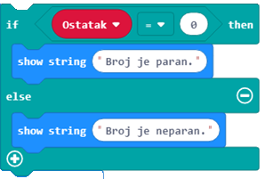

Puna me blloqet nga kategoria Logic
============================================

Programet që kemi krijuar deri më tani janë ekzekutuar në bllok, nga blloku i parë deri tek i fundit. Ky lloj ekzekutimi i programit quhet **sekuencial**. Në ekzekutimin vijues (linear), bllokimi (bllokimi) nuk është i mundur. Ata të gjithë ekzekutohen një herë (nëse janë brenda bllokut |onstart|) ose shumë herë (nëse janë brenda bllokut |forever|).

.. |onstart| image:: ../_images/_imageMicroBit/s20.png
.. |forever| image:: ../_images/_imageMicroBit/s1.png

Sidoqoftë, mund të ndodhë që detyra për të cilën po punoni kërkon që të ndryshoni mënyrën e ekzekutimit të programit.

Për shembull, nëse jeni duke krijuar një program që do të përdoret nga studentët më të rinj për të mësuar llogaritjen (aritmetikën), mund të dëshironi të ekzekutoni blloqe të caktuara, të cilat i përdorni për të vlerësuar përgjigjen e saktë ose mund të dëshironi të ekzekutoni blloqe krejtësisht të ndryshme, të cilat jepni komente për përgjigjet e pasakta.

Bazuar në faktin nëse një përgjigje është e saktë ose e pasaktë, mund të keni nevojë të ekzekutoni grupe të ndryshme blloqesh. Kjo është arsyeja pse ne themi që programi formon degë, d.m.th që blloqe nga një degë po ekzekutohen, ndërsa blloqet nga një degë tjetër nuk janë.

Ju merrni vendime çdo ditë dhe vazhdoni aktivitetet tuaja të përditshme bazuar në to. Për shembull, temperatura në klasë është 30 gradë Celsius, dhe ju dëshironi të ndizni kondicionerin. Hapi juaj i ardhshëm do të ishte të kontrolloni temperaturën në klasë dhe të vendosni nëse dëshironi të ndizni kondicionerin.

Është e ngjashme kur bëhet fjalë për programim.

Në lidhje me vendimmarrjen, MakeCode ofron:

  • Operatorët e Krahasimit

  • Blloqe vendimmarrjeje (blloqe të kushtëzuara, të cilat formojnë degë brenda programit)

.. image:: ../_images/_imageMicroBit/p59.png
        :align: center

.. image:: ../_images/_imageMicroBit/p60.png
        :align: center

Duke përdorur një operator krahasimi, ju mund të krahasoni vlerat dhe të përcaktoni nëse njëra është më e madhe / më e vogël se tjetri ose nëse ato janë të barabarta. Rezultati i krahasimit mund të jetë ``TRUE`` ose ``FALSE``.

.. mchoice:: L6Z1
   :answer_a: Si rezultat i ekzekutimit të bllokut A, programi do të tregojë vlerën e temperaturës në dhomë.
   :answer_b: Ekzekutimi i blloqeve A dhe B do të ketë të njëjtin rezultat - programi do të shkruajë temperaturën e dhomës.
   :answer_c: Si rezultat i ekzekutimit të bllokut B, programi do të shfaqë një kryq të vogël.
   :feedback_a: Përgjigja nuk është e saktë!
   :feedback_b: Përgjigja është e saktë!
   :feedback_c: Përgjigja nuk është e saktë!
   :correct: b

Temperatura në dhomë është 28 gradë celsius. Analizoni blloqet e dhëna në figurë dhe shënoni fjalinë e saktë.

    .. image:: ../_images/_imageMicroBit/p61.png
            :align: center

Le të shkruajmë disa programe!

Ekziston një sfidë para jush, nëse një numër i zgjedhur rastësisht (nga intervali 0 deri në 100) është një numër i barabartë, duhet të shfaqni tekstin "Numri është i barabartë.", Dhe nëse numri është një numër i çuditshëm, ju duhet të tregojë tekstin "Numri është i rastësishëm".

Kur është një numër madje, dhe kur është i çuditshëm? Nëse duke përdorur ndarjen e numrave të plotë, ne ndajmë një numër me 2, dhe nuk ka mbetur, numri konsiderohet i barabartë. Nëse, kur përdorim ndarjen e numrave të plotë për të ndarë një numër me 2, pjesa e mbetur është 1, atëherë e dimë se është një numër i çuditshëm.

Për shembull, nëse përdorim ndarjen e plotë për të ndarë 10 me 2, rezultati do të jetë 5 sepse 5 * 2 është i barabartë me 10. Megjithatë, nëse ndajmë 9 me 2, marrim 4; 4 * 2 është 8, dhe ne kemi mbetur me pjesën e mbetur 1. Nga këtu mund të konkludojmë se, nëse nuk ka mbetje kur një numër është i ndarë me 2 duke përdorur ndarje të plotë, atëherë është një numër i barabartë. Përndryshe, numri është i çuditshëm.

Në MakeCode, ju mund të shkruani ndarjen e numrit të plotë duke përdorur operacionin |deljenje|, dhe pjesën e mbetur duke përdorur bllokun |celobrojno|, i cili siguron vlerën për pjesën e mbetur.

.. |deljenje| image:: ../_images/_imageMicroBit/p62.png
.. |celobrojno| image:: ../_images/_imageMicroBit/p63.png

Bazuar në mësimin e mëparshëm, ne do të përcaktojmë variablin ``Number``, e cila ruan vlerën e marrë nga përdorimi i bllokut |pickrandom| intervalit ``nga 0 në 100``.

.. |pickrandom| image:: ../_images/_imageMicroBit/p49.png

Hapi tjetër do të ishte të kontrolloni nëse ka një pjesë të pjesshme në ndarjen e plotë të Numrit me 2. Nëse është e vërtetë që nuk ka asnjë të mbetur, atëherë mesazhi "Numri është i barabartë". do të shfaqet. Përndryshe, nëse kushti nuk është përmbushur, dhe ka një pjesë të mbetur, atëherë mesazhi "Numri është i çuditshëm". do të shfaqet.

Para se të kontrollojmë gjendjen, do të duhet të krijojmë variablit ``Reminder``, dhe të vendosim një vlerë për ndarjen e plotë të ``Number`` dhe ``number 2``:

.. image:: ../_images/_imageMicroBit/p64.png
        :align: center

Tani, hapi tjetër do të ishte të kontrolloni nëse numri është në rregull apo jo. Kjo do të bëhet duke prezantuar bllokun ``if .... else ... then`` dhe një operator krahasimi. Nëse Mbajtësi i ndryshueshëm është 0, numri është i barabartë dhe mesazhi "Numri është i barabartë". do të shfaqet. Përndryshe, nëse Rikujtuesi i ndryshueshëm nuk është 0, numri është i rastësishëm dhe mesazhi "Numri është i rastësishëm". do të shfaqet.

Pamja finale e bllokut:
 
.. image:: ../_images/_imageMicroBit/p66.png
        :align: center

Ju mund ta shihni kodin në lidhjen e mëposhtme: https://makecode.microbit.org/_WDmbuk3kKXW5

Për të provuar programin, do ta ekzekutojmë në simulator duke klikuar në butonin |play|.

.. |play| image:: ../_images/_imageMicroBit/p3.png

**Detyrë:** Shkruaj një program, i cili simulon zare. Nëse rezultati i rrotullës (një lëvizje - shkundje është regjistruar) është numri 1, ky numër duhet të përfaqësohet nga një pikë; nëse rezultati është 2, ai duhet të përfaqësohet nga dy pika, etj.

Krahasoni zgjidhjen tuaj me tonën: https://makecode.microbit.org/_HsxKqAC90d5m

**Shtesa:** Ju mund të përdorni operatorë logjikë (Boolean) për kushtet e lidhjes.

Në MakeCode, operatorët logjikë paraqiten si më poshtë:

|And| - lidh dy kushte dhe kthehet si rezultat vetëm nëse të dyja kushtet janë të vërteta.

|Or| - lidh dy kushte dhe kthimin e vërtetë si rezultat vetëm nëse të paktën një kusht është i vërtetë.

|No| - vendoset para një kushti dhe kthehet i vërtetë pasi rezultati në rast se kushti nuk plotësohet.

.. |and| image:: ../_images/_imageMicroBit/s50.png
.. |or| image:: ../_images/_imageMicroBit/s51.png

.. |no| image:: ../_images/_imageMicroBit/s52.png
      :width: 100px

Kushti për të kontrolluar që temperatura e matur është më e lartë se 28, dhe niveli i dritës është më i lartë se 150 (niveli i dritës së bllokut) kontrollohet nga ky bllok:

