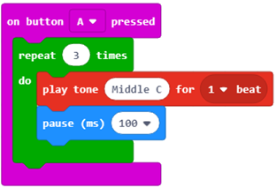

Puna me blloqet nga kategoria e Loops
================================================

Ka procese në natyrë që përsëriten vazhdimisht ose herë pas here. Ashtu si në natyrë, në programim, ndonjëherë është e nevojshme të përsërisni disa pjesë të programit disa herë. Ne kemi përmendur tashmë se përsëritja e një ose më shumë komandave (blloqeve) është një koncept i fuqishëm në programim. Kur disa nga komandat e programit përsëriten disa herë, ne themi se programi përmban sythe. Ne e kemi përdorur këtë koncept disa raste më parë.

Përsëritja e komandave është një dukuri shumë e zakonshme në programim.

.. |stop| image:: ../_images/_imageMicroBit/p2.png

MakeCode ka tre lloje të blloqeve në të cilat blloqe të tjerë, ekzekutimi i të cilave duhet të përsëritet, mund të futen. Blloqet mund të përsëriten:

  - disa herë:

  .. image:: ../_images/_imageMicroBit/p68.png
        :align: center

  Ne duhet ta përdorim këtë bllok kur e dimë paraprakisht numrin e saktë të përsëritjeve (ato quhen edhe përsëritje).

   - një numër i pafund herësh (vazhdimisht, derisa përdoruesi të ndalojë programin):

  .. image:: ../_images/_imageMicroBit/s1.png
        :align: center

  Ky është një nga blloqet më të përdorura. Ekzekutimi i këtij blloku ndalet kur përdoruesi klikon butonin stop (|stop|).

   - derisa të përmbushet një kusht i caktuar:

  .. image:: ../_images/_imageMicroBit/p68.png
          :align: center

  Ne duhet ta përdorim këtë bllok kur nuk e dimë se sa herë blloqet e futura në bllokun e përsëritjes duhet të ekzekutohen, dhe për këtë arsye, duam që ata të ecin derisa të përmbushet një gjendje e caktuar.
   Blloqet, të cilat duhet të përsëriten, tërhiqen dhe futen në blloqe përsëritje.

Blloku, i cili do të përsërisë blloqe të tjera në një numër të saktë, mund të përdoret për të riprodhuar tonin C tre herë.

Pamja e kodit:

Blloku për përsëritjen e komandave do të ekzekutohet një numër të pafund herësh. Vrapimi nuk do të ndalet kurrë më vete. Mund të ndalojmë ekzekutimin duke klikuar në butonin stop (|stop|).

Ne i përdorëm blloqet për të përsëritur në mësimet tona të mëparshme kur shfaqëm animacionin e një katrori.

.. mchoice:: L7Z1
     : answer_a: Blloqe të reja mund të futen në bllok vetë, kështu që nuk ka nevojë për të vazhduar skenarin.
     : answer_b: ashtë një gabim në MakeCode. Blloku që përsërit komandat një numër të pafund herësh duhet të ketë mundësinë që të vazhdojë stacking skenarin.
     : answer_c: Shtimi i blloqeve të mëtejshme do të ishte i kotë pasi ato nuk do të ekzekutoheshin kurrë.
     : feedback_a: Përgjigja është e saktë!
     : e saktë: a
     : feedback_b: Përgjigja nuk është e saktë!
     : feedback_c: Përgjigja nuk është e saktë!
    
    Analizoni pamjen e blloqeve. Ju mund të shihni që blloku foever i përdorur për përsëritjen e komandave në kohë të pacaktuar nuk ka mundësinë e lidhjes me blloqe të tjera, blloqe të tjera nuk mund të shtohen në të. Pse?

Blloku që përsërit blloqet e tjera (komandat) funksionon derisa të përmbushet një kusht specifik. Blloqet brenda këtij blloku ekzekutohen bazuar në kontrollin nëse kushti është përmbushur apo jo. Ne e përdorim këtë bllok kur nuk e dimë sa herë duhet të përsërisim komandat brenda tij, dhe duam që ata të ekzekutojnë derisa të përmbushet një kusht specifik.

.. mchoice:: L7Z2
    :answer_a: Blloku që përsërit komandat një numër të caktuar herësh.
    :answer_b: Blloku që përsërit komandon një numër të pafund herësh.
    :answer_c: Blloku që përsërit komandat derisa të përmbushet një kusht i caktuar.
    :correct: c
    :feedback_a: Përgjigja nuk është e saktë!
    :feedback_b: Përgjigja nuk është e saktë!
    :feedback_c: Përgjigja është e saktë!
    

    Ju dëshironi të krijoni një program, i cili vazhdimisht ndizet LED në ekran me koordinatat (2,2) derisa niveli i dritës të bjerë nën një vlerë të caktuar. Cilat blloqe do të përdorni për përsëritjen e komandave?

Ne do të demonstrojmë përdorimin e këtij blloku duke krijuar një program që luan një ton për aq kohë sa niveli i dritës është më i ulët se 120.

Për qëllimet e këtij programi, ne do të përcaktojmë variablin |svetlost|, e cila do të ruajë vlerën e leximit të nivelit të dritës. Për sa kohë që vlera e nivelit të dritës është më pak se 120, një sinjal i zërit do të lëshohet.
Në figurën më poshtë mund të gjeni sugjerimin tonë për kodin, së bashku me komentet që e shpjegojnë atë. Programuesit konsiderojnë të komentojnë skriptet dhe të shpjegojnë se çfarë është e dobishme në secilin bllok. Komentimi ua lehtëson programuesve të tjerë të kuptojnë dhe azhornojnë programet që kemi krijuar.
Mund të shtoni një koment duke klikuar me të djathtën në skenar dhe duke zgjedhur opsionin **Add comment**.
 

.. image:: ../_images/_imageMicroBit/p72.png
      :align: center

Për të provuar programin, ne do ta ekzekutojmë në simulator duke klikuar butonin |play|.

.. |play| image:: ../_images/_imageMicroBit/p3.png
